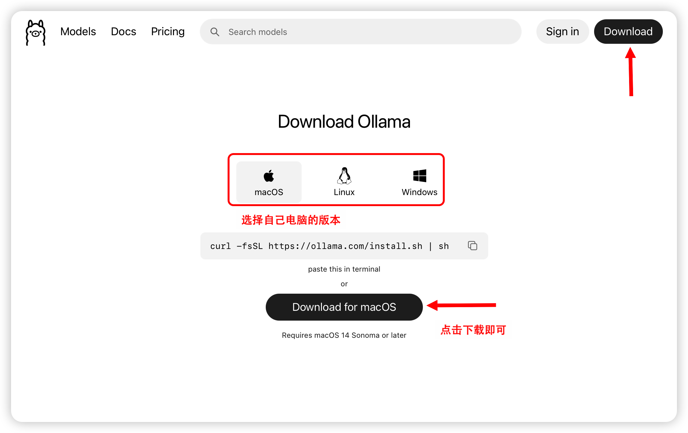
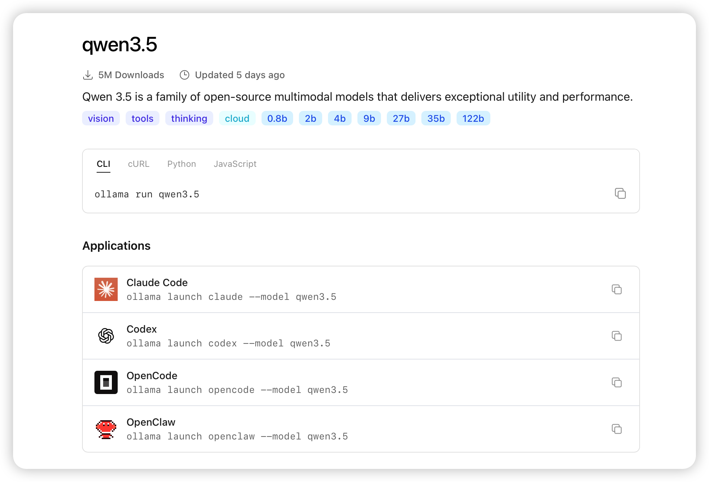
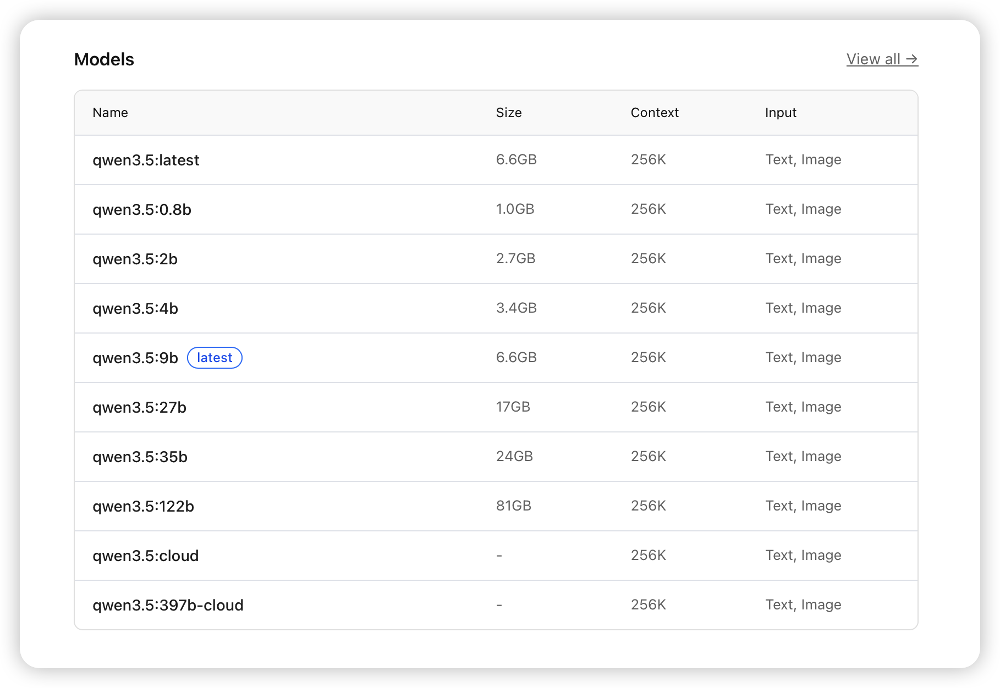
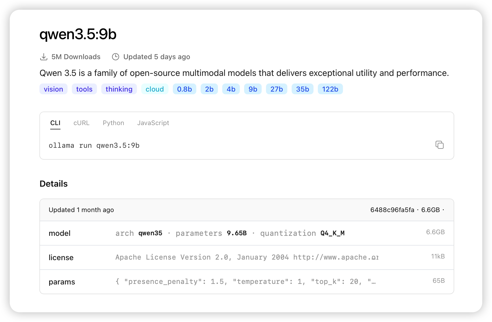
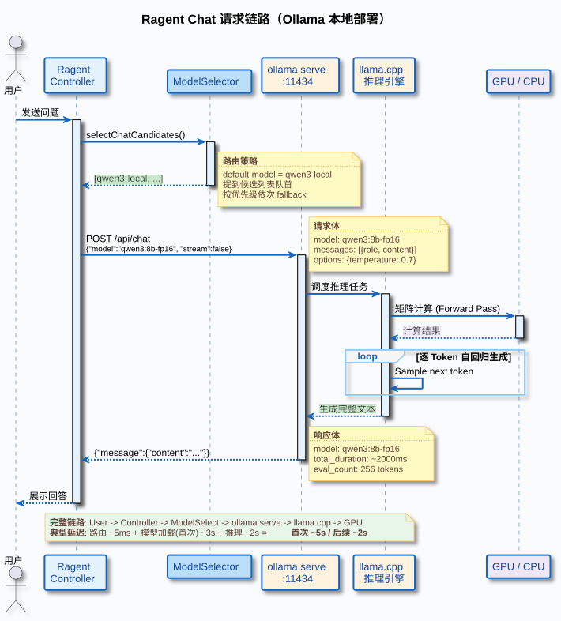
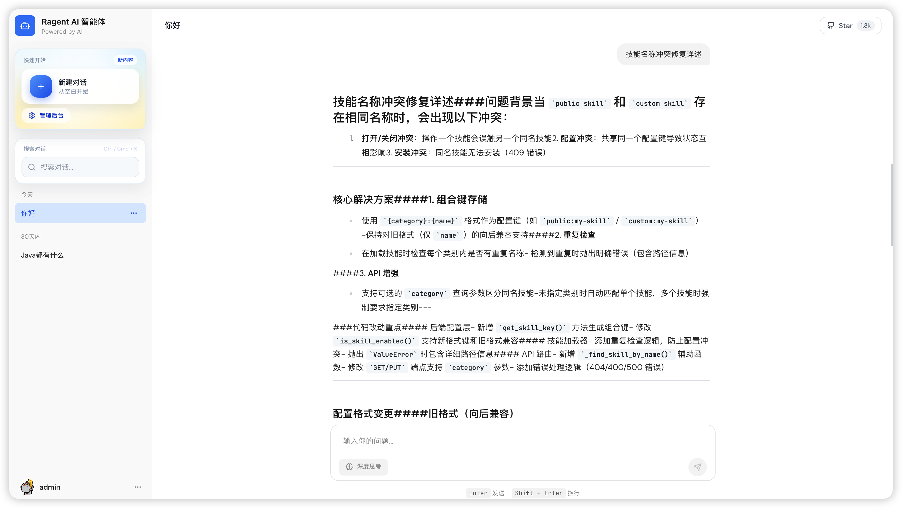

# 《AI大模型Ragent项目》——Ollama安装与模型调用实战

## 概念讲完了，这篇动手

上一篇把 Ollama 的架构、API、环境变量、硬件调度这些概念全部拆开讲了一遍。这一篇只做一件事：**装 Ollama，拉模型，改 Ragent 配置，让整条 RAG 链路跑在本地。**

读完本篇之后的状态是：Ragent 的 Chat 和 Embedding 都打到 `localhost:11434`，断网也能问答，在活动监视器里能看到 Ollama 进程在吃显存。全程不写一行 Java 代码——Ragent 的 provider 可插拔架构帮你扛了，你只需要改两行 YAML。

## 装 Ollama：三平台快速起步

### 1. macOS

两种方式选一种：

**Homebrew 安装：**

textjavascripttypescriptcsshtmlbashjsonmarkdownpythonjavaccpprubygorustphpsqlyaml Copy

```
                brew install ollama

```

**官网安装：**

去 [ollama.com](https://ollama.com/) 下载 macOS 安装包（dmg），双击安装。



装完之后，Ollama 桌面应用会自动启动，状态栏会出现一个羊驼图标，`ollama serve` 已经在后台跑了。

### 2. Windows

同上，官网下载安装包双击安装就行。装完 Ollama 会以后台服务形式运行，后续命令在 PowerShell 里都能用。

### 3. Linux

官方提供了一键安装脚本：

textjavascripttypescriptcsshtmlbashjsonmarkdownpythonjavaccpprubygorustphpsqlyaml Copy

```
                curl -fsSL https://ollama.com/install.sh | sh

```

这个脚本会做三件事：下载 Ollama 二进制文件、创建 `ollama` 系统用户、自动注册 systemd 服务并启动。

装完用 `systemctl` 查看状态：

textjavascripttypescriptcsshtmlbashjsonmarkdownpythonjavaccpprubygorustphpsqlyaml Copy

```
                sudo systemctl status ollama

```

看到 `active (running)` 就说明服务已经在跑了。

**环境变量怎么改？**

Linux 上 Ollama 作为 systemd 服务运行，环境变量不能直接 `export`，要通过 `systemctl edit` 来覆盖：

textjavascripttypescriptcsshtmlbashjsonmarkdownpythonjavaccpprubygorustphpsqlyaml Copy

```
                sudo systemctl edit ollama

```

在打开的编辑器里添加：

textjavascripttypescriptcsshtmlbashjsonmarkdownpythonjavaccpprubygorustphpsqlyaml Copy

```
                [Service]
Environment="OLLAMA_HOST=0.0.0.0:11434"

```

保存后重启服务：

textjavascripttypescriptcsshtmlbashjsonmarkdownpythonjavaccpprubygorustphpsqlyaml Copy

```
                sudo systemctl daemon-reload
sudo systemctl restart ollama

```

上面这个例子把监听地址从默认的 `127.0.0.1` 改成了 `0.0.0.0`，允许局域网内其他机器访问。这是一个很典型的场景：团队里一台 GPU 服务器装了 Ollama，其他同事的开发机通过内网 IP 调用。

### 4. 验证装好了

三个平台通用的验证步骤：

textjavascripttypescriptcsshtmlbashjsonmarkdownpythonjavaccpprubygorustphpsqlyaml Copy

```
                # 看版本
ollama --version

```

应该输出类似 `ollama version 0.18.x` 的版本号。

textjavascripttypescriptcsshtmlbashjsonmarkdownpythonjavaccpprubygorustphpsqlyaml Copy

```
                # 看服务是否在跑
curl http://localhost:11434

```

返回 `Ollama is running` 就说明 `ollama serve` 正常启动了。

textjavascripttypescriptcsshtmlbashjsonmarkdownpythonjavaccpprubygorustphpsqlyaml Copy

```
                # 看本地模型列表
ollama list

```

刚装完应该是空的，后面拉了模型就会有记录。

## Ollama Models 介绍

装好 Ollama 之后，下一步是挑模型。Ollama 官方维护了一个模型库（[ollama.com/search](https://ollama.com/search)），收录了主流的开源模型，可以直接 `ollama pull` 拉取。在拉模型之前，先了解一下模型库里的信息怎么看，后面挑 tag 的时候心里才有数。

### 1. 模型概览页

以 `qwen3.5` 为例，打开它的模型页面能看到这些关键信息：



几个值得关注的点：

- **下载量**：5M Downloads，说明这个模型系列在 Ollama 社区的使用量很大，稳定性和兼容性有保障。

- **能力标签**：`vision`（图像理解）、`tools`（工具调用 / Function Call）、`thinking`（深度思考 / CoT）、`cloud`（云端版本）。这些标签直接告诉你模型支持哪些能力，不用去翻论文。

- **规格标签**：`0.8b`、`2b`、`4b`、`9b`、`27b`、`35b`、`122b`——同一个模型系列提供了从不到 10 亿到 1220 亿参数的多种规格，按你的显存大小挑。

- **调用方式**：页面上直接给出了 CLI、cURL、Python、JavaScript 四种调用方式的命令。CLI 方式就是 `ollama run qwen3.5`，一行命令直接跑。

- **Applications**：列出了兼容的应用，比如 Claude Code、Codex、OpenCode、OpenClaw 等，可以通过 `ollama launch` 命令直接启动这些应用并指定模型。

### 2. 模型规格列表

往下翻到 Models 区域，能看到这个模型系列所有可用的 tag：



这张表是挑模型 tag 的核心参考：

| 名称 | 大小 | 上下文窗口 | 输入类型 |
| --- | --- | --- | --- |
| qwen3.5:latest | 6.6GB | 256K | Text, Image |
| qwen3.5:0.8b | 1.0GB | 256K | Text, Image |
| qwen3.5:2b | 2.7GB | 256K | Text, Image |
| qwen3.5:4b | 3.4GB | 256K | Text, Image |
| qwen3.5:9b（latest） | 6.6GB | 256K | Text, Image |
| qwen3.5:27b | 17GB | 256K | Text, Image |
| qwen3.5:35b | 24GB | 256K | Text, Image |
| qwen3.5:122b | 81GB | 256K | Text, Image |
| qwen3.5:cloud | - | 256K | Text, Image |
| qwen3.5:397b-cloud | - | 256K | Text, Image |

几个要点：

- **latest 指向 9b**：直接 `ollama run qwen3.5` 拉的就是 9b 规格，6.6GB。大多数模型的 latest 都是一个中等偏小的规格，不会一上来就给你拉个几十 GB 的大家伙。

- **Size 列是磁盘占用**：这个大小是量化后的体积。比如 9b 只有 6.6GB 而不是 fp16 的 ~18GB，说明默认 tag 用的是量化版（通常是 Q4_K_M）。加载到显存后的实际占用会略大一些，但量级差不多。

- **全系列支持 256K 上下文**：Qwen3.5 全系列都有 256K 的上下文窗口，但实际能用多长取决于你的显存——上下文越长，KV Cache 占用越大。

- **全系列支持多模态输入**：Text + Image，意味着这些模型既能处理文本也能理解图片。

- **cloud 版本**：Size 显示 `-`，说明这不是本地模型，而是通过 Ollama 调用云端 API。适合显存不够但想体验大参数模型效果的场景。

### 3. 具体 tag 的详情页

点进某个具体的 tag（比如 `qwen3.5:9b`），能看到这个 tag 的详细信息：



Details 区域包含了几个关键字段：

- **model**：架构 `qwen35`，参数量 `9.65B`，量化格式 `Q4_K_M`，文件大小 `6.6GB`。这里能确认默认 tag 用的确实是 Q4_K_M 量化，不是 fp16 全精度。

- **license**：Apache License 2.0，意味着可以商用。选模型时许可证很重要，尤其是企业场景。

- **params**：模型的默认推理参数，比如 `presence_penalty: 1.5`、`temperature: 1`、`top_k: 20`。这些参数是 Modelfile 里定义的，`ollama run` 时会自动生效。如果觉得模型回答太发散或太保守，可以通过 Ollama API 的请求参数覆盖。

> 挑模型的一般思路：先在规格列表里按显存大小圈定范围（比如 16GB 显存选 9b 或以下），再看默认 tag 的量化格式够不够用。学习阶段想要最接近原始模型效果的，选 fp16 tag；显存紧张或日常开发用，默认量化档就行。

## 拉模型：Chat 和 Embedding 各一个

### 1. 为什么选这两个 tag

本篇要拉的两个模型：

- **Chat**：`qwen3:8b-fp16`

- **Embedding**：`qwen3-embedding:8b-fp16`

选它们的原因有两条。一是 Ragent 的 `application.yaml` 里 Ollama 候选配的就是这俩 tag，拉下来直接能对接，不用改模型名。二是 fp16 精度最接近原始模型，学习阶段用它能最真实地感受本地模型的效果水平，方便和之前用的云端模型做对比。

> 如果你的显存不够跑 fp16（后面会讲怎么判断），可以换成 `qwen3:8b`（默认量化档，磁盘约 5GB）或者更小的 `qwen3:4b`。但改了 tag 就要同步改 Ragent 的 `application.yaml` 里对应 candidate 的 `model` 字段，保持一致。
>
>
>
> ⚠️注意，因为 fp16 对显存和 GPU 的处理器要求偏高，可能电脑会很卡等，如果电脑配置较低的同学，建议选上面的默认小模型。

### 2. 拉 Chat 模型

textjavascripttypescriptcsshtmlbashjsonmarkdownpythonjavaccpprubygorustphpsqlyaml Copy

```
                ollama pull qwen3:8b-fp16

```

拉取过程会显示进度条，模型按层下载。fp16 的 8B 模型大约 16GB，网速正常的话几分钟到十几分钟。拉完之后用 `ollama list` 确认：

textjavascripttypescriptcsshtmlbashjsonmarkdownpythonjavaccpprubygorustphpsqlyaml Copy

```
                ollama list

```

应该能看到这条记录：

textjavascripttypescriptcsshtmlbashjsonmarkdownpythonjavaccpprubygorustphpsqlyaml Copy

```
                NAME               ID              SIZE      MODIFIED
qwen3:8b-fp16      0b358e6e9d8c    16 GB     About a minute ago

```

### 3. 拉 Embedding 模型

textjavascripttypescriptcsshtmlbashjsonmarkdownpythonjavaccpprubygorustphpsqlyaml Copy

```
                ollama pull qwen3-embedding:8b-fp16

```

拉完再看一次 `ollama list`，现在应该有两个模型了：

textjavascripttypescriptcsshtmlbashjsonmarkdownpythonjavaccpprubygorustphpsqlyaml Copy

```
                NAME                             ID              SIZE      MODIFIED
qwen3:8b-fp16                    0b358e6e9d8c    16 GB     4 months ago
qwen3-embedding:8b-fp16          aa924958585e    15 GB     4 months ago

```

想看这个模型的详细信息，可以用 `ollama show`：

textjavascripttypescriptcsshtmlbashjsonmarkdownpythonjavaccpprubygorustphpsqlyaml Copy

```
                ollama show qwen3-embedding:8b-fp16

```

会输出 Modelfile 的内容、参数配置、模型架构信息等。上一篇讲过 Modelfile 的各个指令，这里不重复了。

### 4. 磁盘与显存预估

两个 fp16 的 8B 模型加起来磁盘占用约 31GB。加载到显存时，每个模型也需要大致相同的空间。如果你的 GPU 显存（或 Apple Silicon 的统一内存）有 32GB 以上，两个模型可以同时驻留；如果只有 16~24GB，同一时间只能加载一个，Ollama 会在切换模型时自动卸载和加载。

### 5. 开启 Flash Attention 降低显存占用

上一篇介绍过 `OLLAMA_FLASH_ATTENTION` 环境变量。fp16 模型本身显存需求就大，开启 Flash Attention 能显著降低长上下文场景的 KV Cache 显存占用，给模型权重留出更多空间。

macOS 设置方式：

textjavascripttypescriptcsshtmlbashjsonmarkdownpythonjavaccpprubygorustphpsqlyaml Copy

```
                launchctl setenv OLLAMA_FLASH_ATTENTION 1

```

设完重启 Ollama 桌面应用生效。

Linux 通过 systemctl edit：

textjavascripttypescriptcsshtmlbashjsonmarkdownpythonjavaccpprubygorustphpsqlyaml Copy

```
                sudo systemctl edit ollama

```

添加：

textjavascripttypescriptcsshtmlbashjsonmarkdownpythonjavaccpprubygorustphpsqlyaml Copy

```
                [Service]
Environment="OLLAMA_FLASH_ATTENTION=1"

```

保存后 `sudo systemctl restart ollama`。

## 命令行对话：先聊两句

模型拉下来了，先用最简单的方式验证它能不能正常回答问题。

textjavascripttypescriptcsshtmlbashjsonmarkdownpythonjavaccpprubygorustphpsqlyaml Copy

```
                ollama run qwen3:8b-fp16

```

第一次运行时 Ollama 需要把模型从磁盘加载到显存，会有几秒到十几秒的等待。加载完成后进入交互式 REPL，直接打字就能聊：

textjavascripttypescriptcsshtmlbashjsonmarkdownpythonjavaccpprubygorustphpsqlyaml Copy

```
                >>> 什么是 RAG？用一句话解释。
RAG（Retrieval-Augmented Generation）是一种将信息检索与文本生成相结合的技术，通过先从知识库中检索相关
文档片段，再将其作为上下文提供给大语言模型来生成更准确、有依据的回答。

>>> /bye

```

输入 `/bye` 退出 REPL。

退出之后，模型并不会立刻从显存卸载——上一篇讲过的 `OLLAMA_KEEP_ALIVE`，默认空闲 5 分钟后才会自动卸载。用 `ollama ps` 能看到模型还在：

textjavascripttypescriptcsshtmlbashjsonmarkdownpythonjavaccpprubygorustphpsqlyaml Copy

```
                ollama ps

```

textjavascripttypescriptcsshtmlbashjsonmarkdownpythonjavaccpprubygorustphpsqlyaml Copy

```
                NAME               ID              SIZE      PROCESSOR    UNTIL
qwen3:8b-fp16      0b358e6e9d8c    16 GB     100% GPU     4 minutes from now

```

`UNTIL` 列显示的就是距离自动卸载还剩多长时间。

## curl 直接打 API：验证两条通路

命令行聊天是给人看的，curl 打 API 是给程序看的。Ragent 的 Java 客户端本质上就是在发这两种 HTTP 请求，所以这一步先用 curl 把两条通路跑通。

### 1. 打 `/api/chat`

textjavascripttypescriptcsshtmlbashjsonmarkdownpythonjavaccpprubygorustphpsqlyaml Copy

```
                curl http://localhost:11434/api/chat \
  -H "Content-Type: application/json" \
  -d '{
    "model": "qwen3:8b-fp16",
    "messages": [
      {"role": "system", "content": "你是一个简洁的技术助手。"},
      {"role": "user", "content": "什么是向量数据库？一句话回答。"}
    ],
    "stream": false
  }'

```

响应（截取关键字段）：

textjavascripttypescriptcsshtmlbashjsonmarkdownpythonjavaccpprubygorustphpsqlyaml Copy

```
                {
  "model": "qwen3:8b-fp16",
  "message": {
    "role": "assistant",
    "content": "向量数据库是一种专门用于高效存储和检索高维向量数据的数据库系统，通过近似最近邻搜索实现语义级别的相似度匹配。"
  },
  "done": true,
  "total_duration": 2481935417,
  "eval_count": 42
}

```

`message.content` 就是模型的回答。Ragent 里 `OllamaChatClient` 解析的也是这个字段。

### 2. 打 `/api/embed`

textjavascripttypescriptcsshtmlbashjsonmarkdownpythonjavaccpprubygorustphpsqlyaml Copy

```
                curl http://localhost:11434/api/embed \
  -H "Content-Type: application/json" \
  -d '{
    "model": "qwen3-embedding:8b-fp16",
    "input": "什么是向量数据库？"
  }'

```

响应（向量太长，只截取头尾）：

textjavascripttypescriptcsshtmlbashjsonmarkdownpythonjavaccpprubygorustphpsqlyaml Copy

```
                {
  "model": "qwen3-embedding:8b-fp16",
  "embeddings": [
    [0.0123, -0.0456, 0.0789, ..., -0.0321, 0.0654, -0.0987]
  ]
}

```

`embeddings[0]` 是一个浮点数数组，就是输入文本的向量表示。`OllamaEmbeddingClient` 解析的也是这个结构。

这里有一个细节值得关注：`qwen3-embedding:8b-fp16` 模型的原生输出维度是 4096，但 Ollama 的 `/api/embed` 接口支持通过 `dimensions` 参数指定输出维度。你可以用 `jq` 验证一下不传 `dimensions` 时的默认输出：

textjavascripttypescriptcsshtmlbashjsonmarkdownpythonjavaccpprubygorustphpsqlyaml Copy

```
                curl -s http://localhost:11434/api/embed \
  -H "Content-Type: application/json" \
  -d '{"model": "qwen3-embedding:8b-fp16", "input": "测试"}' \
  | jq '.embeddings[0] | length'

```

textjavascripttypescriptcsshtmlbashjsonmarkdownpythonjavaccpprubygorustphpsqlyaml Copy

```
                4096

```

再试一下传 `dimensions: 1536`：

textjavascripttypescriptcsshtmlbashjsonmarkdownpythonjavaccpprubygorustphpsqlyaml Copy

```
                curl -s http://localhost:11434/api/embed \
  -H "Content-Type: application/json" \
  -d '{"model": "qwen3-embedding:8b-fp16", "input": "测试", "dimensions": 1536}' \
  | jq '.embeddings[0] | length'

```

textjavascripttypescriptcsshtmlbashjsonmarkdownpythonjavaccpprubygorustphpsqlyaml Copy

```
                1536

```

Ollama 会把模型的 4096 维输出截断到你指定的维度。Ragent 的 `OllamaEmbeddingClient` 已经做了这件事——它会读取 candidate 配置里的 `dimension` 字段，自动带上 `dimensions` 参数。所以只要 yaml 里的 `dimension` 配对了，维度就不会出问题。

### 3. 这两个请求就是 Ragent 在做的事

上面两个 curl 请求的 URL、请求体结构、响应解析方式，就是 Ragent 里 `OllamaChatClient` 和 `OllamaEmbeddingClient` 干的事。区别只是它们用 OkHttp 发 HTTP 请求而不是 curl。下一节你不需要写这套 HTTP 代码，Ragent 已经替你写好了。

> 你可能注意到了：上一篇建议 Java 开发者优先用 OpenAI 兼容 API（`/v1/chat/completions`），但 Ragent 实际用的是 Ollama 原生 API（`/api/chat`、`/api/embed`）。这是因为 Ragent 为每个 provider 写了专用的客户端类，原生 API 能更精确地映射 Ollama 特有的参数——比如 `OllamaChatClient` 把 `maxTokens` 映射为 Ollama 的 `num_predict`（而不是 OpenAI 协议的 `max_tokens`）。如果你自己写一个独立项目、不想为每个 provider 单独写客户端，那直接用 `/v1/` 兼容 API 就是最省事的方案。

## 让 Ragent 用上本地模型：改配置，不改代码

### 1. Ragent 的 Ollama 接入现状

Ragent 的 `infra-ai` 模块已经内置了两个 Ollama 客户端：

- `OllamaChatClient`（`infra-ai/.../infra/chat/OllamaChatClient.java`）—— 对接 `/api/chat`

- `OllamaEmbeddingClient`（`infra-ai/.../infra/embedding/OllamaEmbeddingClient.java`）—— 对接 `/api/embed`

Chat 请求的路由由 `RoutingLLMService` 负责，Embedding 请求的路由由 `RoutingEmbeddingService` 负责。它们都从 `ModelSelector` 拿候选模型列表，依次尝试，带有熔断和 fallback 能力——某个模型连续失败后会被短时间跳过，自动切到下一个候选。

`application.yaml` 里 Ollama 相关的配置已经写好了。你要做的只是把 Ollama 从候选中的备选变成主用。

### 2. 现有配置长什么样

先看 `application.yaml` 里和 Ollama 相关的三块：

**Provider 配置：**

textjavascripttypescriptcsshtmlbashjsonmarkdownpythonjavaccpprubygorustphpsqlyaml Copy

```
                ai:
  providers:
    ollama:
      url: http://localhost:11434
      endpoints:
        chat: /api/chat
        embedding: /api/embed

```

URL 和端点都配好了，指向本地 11434 端口。

**Chat 候选列表：**

textjavascripttypescriptcsshtmlbashjsonmarkdownpythonjavaccpprubygorustphpsqlyaml Copy

```
                ai:
  chat:
    default-model: qwen3-max          # 当前默认走百炼云端
    candidates:
      - id: qwen-plus
        provider: bailian
        model: qwen-plus-latest
        priority: 1
      - id: qwen3-max
        provider: bailian
        model: qwen3-max
        supports-thinking: true
        priority: 3
      - id: glm-4.7
        provider: siliconflow
        model: Pro/zai-org/GLM-4.7
        supports-thinking: true
        priority: 0
      - id: qwen3-local               # 本地 Ollama 候选
        provider: ollama
        model: qwen3:8b-fp16
        priority: 2

```

**Embedding 候选列表：**

textjavascripttypescriptcsshtmlbashjsonmarkdownpythonjavaccpprubygorustphpsqlyaml Copy

```
                ai:
  embedding:
    default-model: qwen-emb-8b        # 当前默认走 SiliconFlow 云端
    candidates:
      - id: qwen-emb-8b
        provider: siliconflow
        model: Qwen/Qwen3-Embedding-8B
        dimension: ${rag.default.dimension}
        priority: 1
      - id: qwen-emb-local            # 本地 Ollama 候选
        provider: ollama
        model: qwen3-embedding:8b-fp16
        dimension: ${rag.default.dimension}
        priority: 2

```

### 3. 模型选择机制

`ModelSelector` 的排序逻辑分两步：

- 1.
把所有 enabled 的候选按 `priority` **升序**排（数字越小优先级越高，0 排最前）

- 2.
如果配了 `default-model`，把它指定的那个候选直接提到队列第 0 位，无视 priority 排序结果

当前配置里，`default-model` 指向 `qwen3-max`（Chat）和 `qwen-emb-8b`（Embedding），都是云端模型。本地候选 `qwen3-local` 虽然 priority=2 也不算高，但被 `default-model` 压在后面。要让流量走本地，得改 `default-model`。

### 4. 直接指定默认模型（推荐）

最简单的方式，改两行：

textjavascripttypescriptcsshtmlbashjsonmarkdownpythonjavaccpprubygorustphpsqlyaml Copy

```
                ai:
  chat:
    default-model: qwen3-local        # 原来是 qwen3-max
  embedding:
    default-model: qwen-emb-local     # 原来是 qwen-emb-8b

```

`default-model` 填的是 candidate 的 `id`。`ModelSelector` 看到这个配置，会直接把 `qwen3-local` 提到 Chat 候选队列的第一位，`qwen-emb-local` 提到 Embedding 候选队列的第一位。请求优先打到本地，本地挂了才 fallback 到云端。

### 5. 维度对齐：不用操心，Ragent 已经处理了

前面用 curl 测过，`qwen3-embedding:8b-fp16` 的原生输出是 4096 维。但 Ragent 当前配置的 `rag.default.dimension` 是 1536：

textjavascripttypescriptcsshtmlbashjsonmarkdownpythonjavaccpprubygorustphpsqlyaml Copy

```
                rag:
  default:
    dimension: 1536

```

两个 Embedding 候选的 `dimension` 都引用了 `${rag.default.dimension}`，所以不管走云端还是本地，Ragent 都会告诉模型输出 1536 维的向量。

这里不需要你手动处理。Ragent 的 `OllamaEmbeddingClient` 在发请求时会自动把 candidate 配置的 `dimension` 值作为 `dimensions` 参数传给 Ollama 的 `/api/embed` 接口。关键代码就这几行：

textjavascripttypescriptcsshtmlbashjsonmarkdownpythonjavaccpprubygorustphpsqlyaml Copy

```
                // OllamaEmbeddingClient.java
if (target.candidate().getDimension() != null) {
    body.addProperty("dimensions", target.candidate().getDimension());
}

```

candidate 配置里 `dimension: ${rag.default.dimension}` 解析出来是 1536，Ollama 收到 `dimensions: 1536` 后会把模型原生的 4096 维输出截断到 1536 维返回。跟云端 SiliconFlow 的行为一致，向量维度完全对齐。

所以切本地 Embedding 时，`rag.default.dimension` 不用改，向量库也不用清——新老向量维度相同，可以无缝混用。

> 如果你想用模型的完整 4096 维输出（理论上信息保留更多，检索精度略有提升），那就需要把 `rag.default.dimension` 改成 4096，同时清空向量库重新入库。但对大多数场景来说，1536 维已经够用，没必要为了这点精度差异去折腾清库。

### 6. 请求链路：改完配置后请求怎么流的

改完 `application.yaml` 之后，一次 Chat 请求在 Ragent 内部走的完整路径：



Embedding 侧的链路类似，只是 `RoutingLLMService` 换成 `RoutingEmbeddingService`，`OllamaChatClient` 换成 `OllamaEmbeddingClient`，端点从 `/api/chat` 换成 `/api/embed`。

## 启动 Ragent 并验证

### 1. 启动并观察日志

确保 Ollama 在跑（`curl http://localhost:11434` 返回 `Ollama is running`），然后启动 Ragent 的 `bootstrap` 模块。

观察启动日志，你应该能看到模型候选注册的信息。如果 `default-model` 改成了 `qwen3-local`，日志里应该有相关的候选排序记录。看不到这些信息说明 yaml 没改对，回去检查 `default-model` 的值是否跟 candidate 的 `id` 完全匹配。

### 2. 发一次问答

从 Ragent 前端页面或者直接调后端接口发一次问答。然后做两个验证：

**验证一：`ollama ps` 看模型加载状态**

开一个新终端：

textjavascripttypescriptcsshtmlbashjsonmarkdownpythonjavaccpprubygorustphpsqlyaml Copy

```
                ollama ps

```

应该能看到 `qwen3:8b-fp16` 处于 loaded 状态：

textjavascripttypescriptcsshtmlbashjsonmarkdownpythonjavaccpprubygorustphpsqlyaml Copy

```
                NAME               ID              SIZE      PROCESSOR    UNTIL
qwen3:8b-fp16      0b358e6e9d8c    16 GB     100% GPU     4 minutes from now

```

**验证二：Ragent 日志看 trace**

`OllamaChatClient.chat()` 方法上打了 `@RagTraceNode(name = "ollama-chat", type = "LLM_PROVIDER")` 注解，`RoutingLLMService.chat()` 上打了 `@RagTraceNode(name = "llm-chat-routing", type = "LLM_ROUTING")`。在 Ragent 的日志里应该能看到这两个 trace 节点被命中。

这两个信号同时出现——`ollama ps` 有模型在跑，Ragent 日志有 `ollama-chat` 的 trace——就证明流量确实打到本地了，没有跑到云端去。

### 3. Embedding 侧验证

上传一个文档到知识库，让入库流水线跑一遍。这时候再看 `ollama ps`，会短暂出现第二个模型 `qwen3-embedding:8b-fp16`：

textjavascripttypescriptcsshtmlbashjsonmarkdownpythonjavaccpprubygorustphpsqlyaml Copy

```
                ollama ps

```

textjavascripttypescriptcsshtmlbashjsonmarkdownpythonjavaccpprubygorustphpsqlyaml Copy

```
                NAME                         ID              SIZE      PROCESSOR    UNTIL
qwen3:8b-fp16                0b358e6e9d8c    16 GB     100% GPU     4 minutes from now
qwen3-embedding:8b-fp16      aa924958585e    15 GB     100% GPU     4 minutes from now

```

> `OllamaEmbeddingClient` 没有 `@RagTraceNode` 注解，所以 Embedding 侧不能靠 trace 日志确认。主要靠 `ollama ps` 看模型是否被加载。Embedding 的请求路由走的是 `RoutingEmbeddingService`，逻辑跟 Chat 侧的 `RoutingLLMService` 一样。

#### 3.1 两个模型同时加载的显存问题

如果你发现 `ollama ps` 里两个模型反复出现又消失，说明显存不够同时装两个，Ollama 在来回卸载加载。

`OLLAMA_MAX_LOADED_MODELS` 的默认值是 3 x GPU 数量（CPU 推理时为 3），数量上不是瓶颈，瓶颈是显存。两个 fp16 的 8B 模型加起来要 30GB+ 的显存，很多消费级显卡装不下。

几个解决思路：

- **显存 32GB 以上**（比如 M2 Pro/Max 或 RTX A6000）：两个模型可以同时驻留，不需要额外操作

- **显存 16~24GB**：Chat 模型占了大头，Embedding 模型会把 Chat 模型挤掉。可以考虑 Chat 用量化版（`qwen3:8b`，约 5GB），fp16 只留给 Embedding，这样两个加起来 20GB 左右

- **设置 `OLLAMA_KEEP_ALIVE`**：如果两个模型不需要真正同时在线（入库和问答不是同时发生），把 `OLLAMA_KEEP_ALIVE` 设长一些（比如 `30m`），减少频繁卸载加载的次数

macOS 设置 `OLLAMA_KEEP_ALIVE`：

textjavascripttypescriptcsshtmlbashjsonmarkdownpythonjavaccpprubygorustphpsqlyaml Copy

```
                launchctl setenv OLLAMA_KEEP_ALIVE 30m

```

Linux 通过 `systemctl edit ollama` 添加：

textjavascripttypescriptcsshtmlbashjsonmarkdownpythonjavaccpprubygorustphpsqlyaml Copy

```
                [Service]
Environment="OLLAMA_KEEP_ALIVE=30m"

```

保存后重启 Ollama 服务。

#### 3.2 小模型效果一般

我用的文中提到的两个模型跑的，生成的内容只能说惨不忍睹。基本上可以断定，企业内部想做 RAG，起码 Qwen3-32B 起步，不然生成效果堪忧。



## 踩坑快查

| 现象 | 原因 | 怎么解 |
| --- | --- | --- |
| curl localhost:11434 报 Connection refused | 11434 端口没人监听，Ollama 没启动或者端口被占 | lsof -i:11434 看是否有旧进程，ollama serve 手动启动试试 |
| ollama pull 卡在某个百分比不动 | 网络问题，国内下载有时需要代理 | 中断后重新 ollama pull，支持断点续传，不会从头下 |
| ollama run 几秒后报 out of memory | 显存塞不下 fp16 模型 | 换默认量化档 qwen3:8b（约 5GB）或更小的 qwen3:4b，同步改 yaml 的 model |
| Ragent 日志显示还在打 SiliconFlow / 百炼 | default-model 没改，或者改错了 id | 检查 default-model 的值是否跟 candidate 的 id 完全匹配（qwen3-local，不是 qwen3:8b-fp16） |
| 切本地后第一次请求特别慢（几秒到十几秒） | 模型首次从磁盘加载到显存，正常冷启动 | 第二次就快了。如果频繁出现冷启动延迟，是 OLLAMA_KEEP_ALIVE 太短或显存不够导致模型被频繁卸载 |
| 向量入库后检索结果全乱或报错 | 如果你手动改了 rag.default.dimension 但没清库，新老向量维度不同 | 要么保持 dimension=1536 不动（Ragent 会自动传 dimensions 参数截断输出），要么改了 dimension 就必须清库重建 |

## 小结

盘点一下本篇干成的事：装 Ollama → 拉 Chat 和 Embedding 两个模型 → `ollama run` 命令行聊天验证 → curl 打两个 API 端点验证 → 改 Ragent 的 `application.yaml`（`default-model` 指向本地候选）→ 启动 Ragent 验证 trace 和 `ollama ps` → 一条完整的本地 RAG 链路跑通。

全程没写一行 Java 代码。Ragent 的 `OllamaChatClient` 和 `OllamaEmbeddingClient` 已经实现了 Ollama 原生 API 的对接，`ModelSelector` 和 `RoutingLLMService` / `RoutingEmbeddingService` 负责路由和熔断。你要做的只是在 yaml 层面告诉 Ragent 优先用哪个 provider，剩下的框架帮你扛。这就是 provider 可插拔架构的价值——换一个模型供应商不需要改代码，改配置就行。

> Source: https://t.zsxq.com/frBrF
> Resolved: https://articles.zsxq.com/id_crrchfsgwfs1.html
