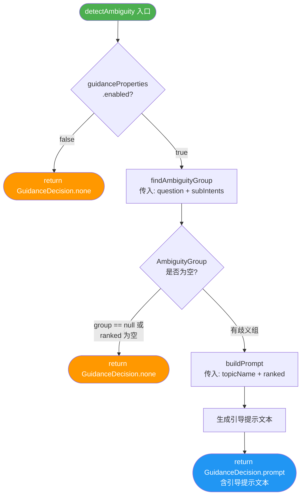
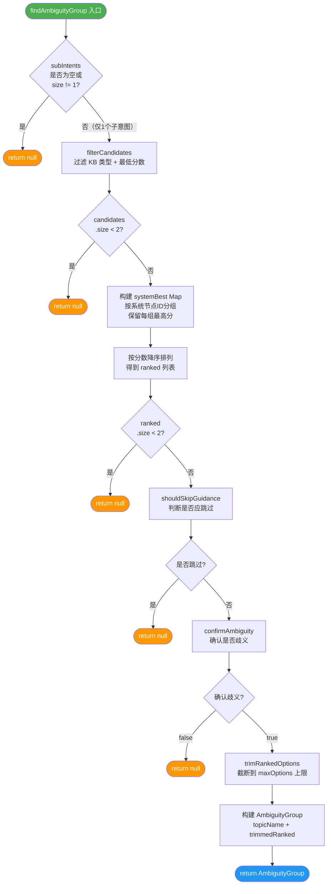
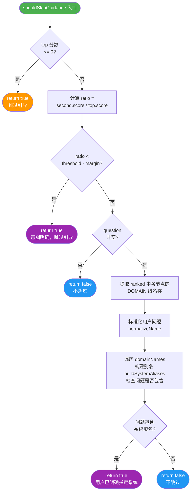
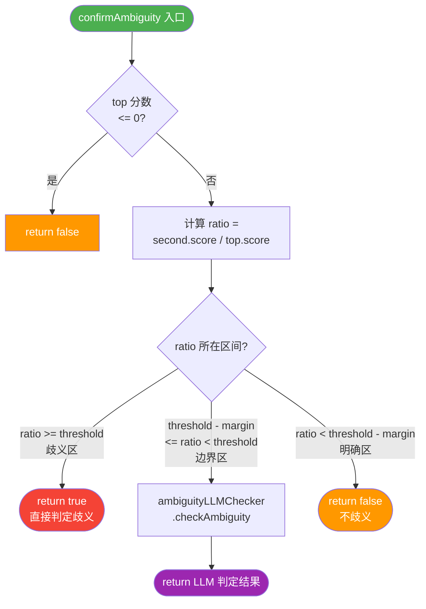
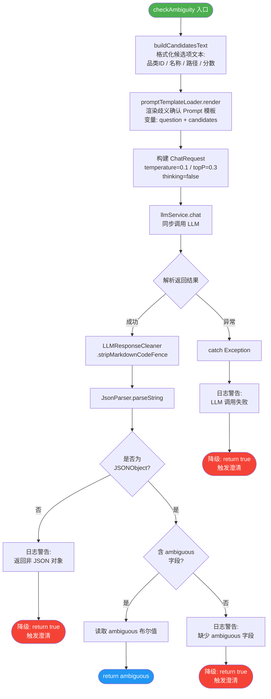
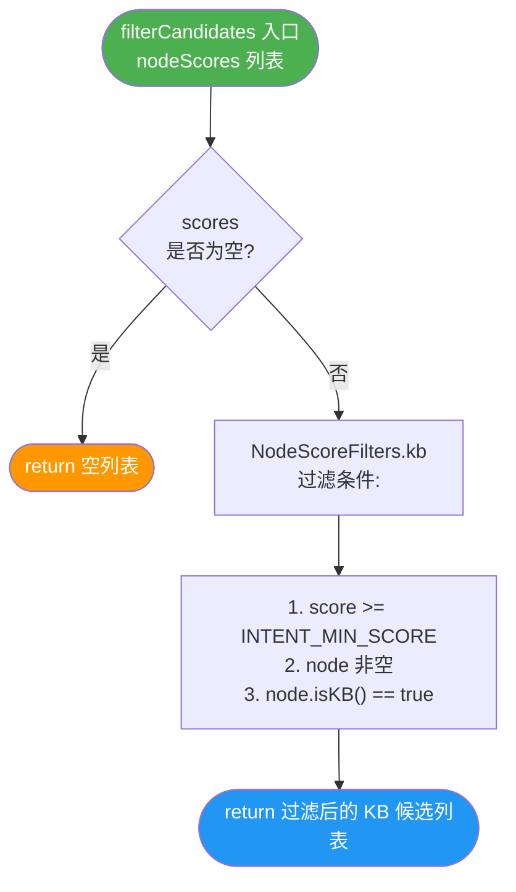
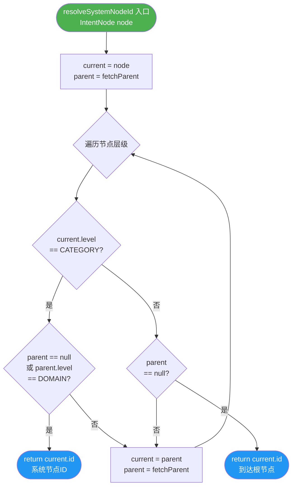
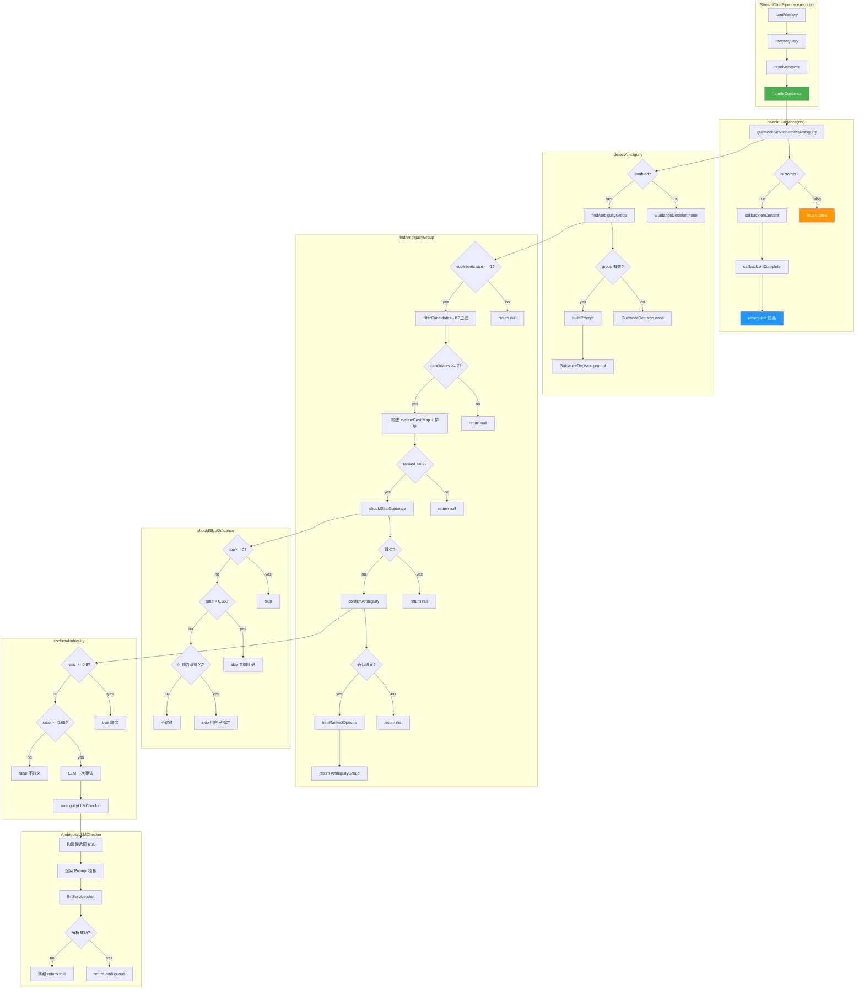

# handleGuidance 完整流程详解

## 概述

`handleGuidance` 是 `StreamChatPipeline` 中的**歧义引导阶段**，在记忆加载、查询改写、意图解析之后执行。其核心目标是：**当用户提问存在品类歧义时，生成引导式澄清提示并通过流式回调返回给用户，短路后续检索和响应流程**。

---

## 顶层调用流程

`handleGuidance` 在管道中的位置：

```
execute()
  ├── loadMemory(ctx)           — 加载对话记忆
  ├── rewriteQuery(ctx)         — 改写 & 拆分查询
  ├── resolveIntents(ctx)       — 意图解析
  ├── handleGuidance(ctx)       — ◀ 歧义引导（本流程）
  │     └── 若触发 → return（短路）
  ├── handleSystemOnly(ctx)     — 纯系统意图处理
  ├── retrieve(ctx)             — 检索
  ├── handleEmptyRetrieval()    — 空检索处理
  └── streamRagResponse()       — 流式 RAG 响应
```

---

## handleGuidance 主流程图

```mermaid
flowchart TD
    START([handleGuidance 入口]) --> DETECT[guidanceService.detectAmbiguity\n传入: rewrittenQuestion + subIntents]
    DETECT --> DECISION{GuidanceDecision\n.isPrompt()?}
    DECISION -- false --> NOT_HANDLED([return false\n管道继续执行])
    DECISION -- true --> SEND_PROMPT[callback.onContent(decision.getPrompt())]
    SEND_PROMPT --> COMPLETE[callback.onComplete()]
    COMPLETE --> HANDLED([return true\n管道短路结束])

    style START fill:#4CAF50,color:#fff
    style HANDLED fill:#2196F3,color:#fff
    style NOT_HANDLED fill:#FF9800,color:#fff
```

---

## detectAmbiguity 详细流程



---

## findAmbiguityGroup 详细流程



---

## shouldSkipGuidance 详细流程



### 分数比值区间说明

| 区间 | ratio 范围 | 行为 |
|------|-----------|------|
| **明确区** | ratio < threshold - margin | 跳过引导（意图明确） |
| **边界区** | threshold - margin ≤ ratio < threshold | 进入 LLM 二次确认 |
| **歧义区** | ratio ≥ threshold | 直接判定歧义 |

> 默认配置：threshold = 0.8, margin = 0.15
> - 明确区：ratio < 0.65
> - 边界区：0.65 ≤ ratio < 0.8
> - 歧义区：ratio ≥ 0.8

---

## confirmAmbiguity 详细流程



---

## AmbiguityLLMChecker.checkAmbiguity 详细流程



> **降级策略**：LLM 调用失败或返回格式异常时，**默认触发澄清**（return true），宁可多问一句也不漏判歧义。

---

## buildPrompt 详细流程

```mermaid
flowchart TD
    START([buildPrompt 入口\ntopicName + ranked]) --> RENDER_OPTS[renderOptions\n遍历 ranked 列表]

    RENDER_OPTS --> LOOP[对每个 NodeScore:\nresolveOptionDisplay]

    LOOP --> DISPLAY_CHECK{node.fullPath\n非空?}
    DISPLAY_CHECK -- 是 --> USE_PATH[使用 fullPath\n作为显示文本]
    DISPLAY_CHECK -- 否 --> USE_NAME[使用 name 或 id\n作为显示文本]

    USE_PATH --> APPEND[格式化为:\n1) 显示文本\n2) 显示文本 ...]
    USE_NAME --> APPEND

    APPEND --> TEMPLATE[promptTemplateLoader.render\n渲染 GUIDANCE_PROMPT_PATH 模板\n变量: topic_name + options]

    TEMPLATE --> RESULT([return 引导提示文本])

    style START fill:#4CAF50,color:#fff
    style RESULT fill:#2196F3,color:#fff
```

---

## filterCandidates 详细流程



---

## resolveSystemNodeId 详细流程



---

## 完整流程总图



---

## 关键配置项

| 配置项 | 配置前缀 | 默认值 | 说明 |
|--------|---------|--------|------|
| `enabled` | `rag.guidance.enabled` | `true` | 是否启用引导式问答 |
| `ambiguityScoreRatio` | `rag.guidance.ambiguity-score-ratio` | `0.8` | 歧义阈值，ratio ≥ 此值直接判定歧义 |
| `ambiguityMargin` | `rag.guidance.ambiguity-margin` | `0.15` | 边界缓冲区宽度，决定 LLM 二次确认区间 |
| `maxOptions` | `rag.guidance.max-options` | `6` | 单次最多展示的选项数量 |

---

## 核心数据结构

### GuidanceDecision

| 字段 | 类型 | 说明 |
|------|------|------|
| `action` | `Action` (NONE / PROMPT) | 决策类型 |
| `prompt` | `String` | 引导提示文本（仅 PROMPT 时有值） |

### AmbiguityGroup（内部 record）

| 字段 | 类型 | 说明 |
|------|------|------|
| `topicName` | `String` | 排名第一的系统名称 |
| `ranked` | `List<NodeScore>` | 按分数降序排列的系统候选列表 |

---

## 涉及的类与文件

| 类 | 文件路径 | 角色 |
|----|---------|------|
| `StreamChatPipeline` | `rag/service/pipeline/StreamChatPipeline.java` | 管道编排，调用 handleGuidance |
| `StreamChatContext` | `rag/service/pipeline/StreamChatContext.java` | 管道上下文，承载 rewriteResult、subIntents |
| `IntentGuidanceService` | `rag/core/guidance/IntentGuidanceService.java` | 歧义检测核心逻辑 |
| `GuidanceDecision` | `rag/core/guidance/GuidanceDecision.java` | 决策结果封装 |
| `AmbiguityLLMChecker` | `rag/core/guidance/AmbiguityLLMChecker.java` | LLM 歧义二次确认 |
| `GuidanceProperties` | `rag/config/GuidanceProperties.java` | 配置项 |
| `NodeScoreFilters` | `rag/core/intent/NodeScoreFilters.java` | 节点分数过滤工具 |
