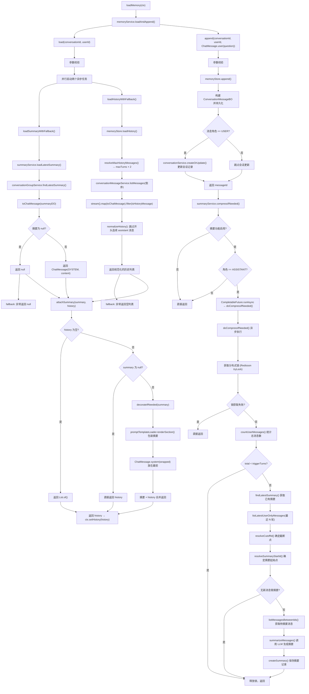

# loadMemory 完整流程详解

## 入口：StreamChatPipeline.loadMemory(ctx)

```java
private void loadMemory(StreamChatContext ctx) {
    List<ChatMessage> history = memoryService.loadAndAppend(
        ctx.getConversationId(),
        ctx.getUserId(),
        ChatMessage.user(ctx.getQuestion())
    );
    ctx.setHistory(history);
}
```

- 将当前用户问题构造为 `ChatMessage.user(question)`
- 调用 `memoryService.loadAndAppend()` 获取历史 + 追加新消息
- 将返回的历史列表设置到上下文 `ctx` 中

---

## 第一层：loadAndAppend()（接口默认方法）

```java
default List<ChatMessage> loadAndAppend(String conversationId, String userId, ChatMessage message) {
    List<ChatMessage> history = load(conversationId, userId);   // 先加载历史
    append(conversationId, userId, message);                     // 再追加新消息
    return history;                                              // 返回追加前的历史
}
```

**关键设计**：先加载、再追加、返回的是追加**前**的历史（不含当前这条新消息）。这样当前轮的 RAG 上下文中不会包含正在生成的回答。

---

## 第二层：load() — DefaultConversationMemoryService

```java
public List<ChatMessage> load(String conversationId, String userId) {
    // 1. 参数校验
    if (StrUtil.isBlank(conversationId) || StrUtil.isBlank(userId)) {
        return List.of();
    }

    // 2. 并行加载摘要和历史记录
    CompletableFuture<ChatMessage> summaryFuture = CompletableFuture.supplyAsync(
        () -> loadSummaryWithFallback(conversationId, userId), memoryLoadExecutor
    );
    CompletableFuture<List<ChatMessage>> historyFuture = CompletableFuture.supplyAsync(
        () -> loadHistoryWithFallback(conversationId, userId), memoryLoadExecutor
    );

    // 3. 等待并行任务完成，合并结果
    return CompletableFuture.allOf(summaryFuture, historyFuture)
        .thenApply(v -> {
            ChatMessage summary = summaryFuture.join();
            List<ChatMessage> history = historyFuture.join();
            return attachSummary(summary, history);
        })
        .join();
}
```

**设计要点**：
- 摘要加载和历史加载**并行执行**，利用独立线程池 `memoryLoadExecutor`
- 两个子任务都有 fallback 机制，失败不影响另一个
- 最后合并摘要 + 历史为完整上下文

---

## 第三层-A：loadSummaryWithFallback()

```java
private ChatMessage loadSummaryWithFallback(String conversationId, String userId) {
    try {
        return summaryService.loadLatestSummary(conversationId, userId);
    } catch (Exception e) {
        log.warn("加载摘要失败，将跳过摘要 ...");
        return null;  // 失败返回 null，不影响整体流程
    }
}
```

调用链：

### summaryService.loadLatestSummary() → JdbcConversationMemorySummaryService

```java
public ChatMessage loadLatestSummary(String conversationId, String userId) {
    ConversationSummaryDO summary = conversationGroupService.findLatestSummary(conversationId, userId);
    return toChatMessage(summary);
}
```

1. 从数据库查询该会话的**最新一条摘要记录**
2. 转换为 `ChatMessage`（Role = SYSTEM）

### toChatMessage()

```java
private ChatMessage toChatMessage(ConversationSummaryDO record) {
    if (record == null || StrUtil.isBlank(record.getContent())) {
        return null;  // 无摘要则返回 null
    }
    return new ChatMessage(ChatMessage.Role.SYSTEM, record.getContent());
}
```

---

## 第三层-B：loadHistoryWithFallback()

```java
private List<ChatMessage> loadHistoryWithFallback(String conversationId, String userId) {
    try {
        List<ChatMessage> history = memoryStore.loadHistory(conversationId, userId);
        return history != null ? history : List.of();
    } catch (Exception e) {
        log.error("加载历史记录失败 ...");
        return List.of();  // 失败返回空列表，不影响整体流程
    }
}
```

调用链：

### memoryStore.loadHistory() → JdbcConversationMemoryStore

```java
public List<ChatMessage> loadHistory(String conversationId, String userId) {
    // 1. 计算最大消息数 = historyKeepTurns × 2（每轮含 user + assistant）
    int maxMessages = resolveMaxHistoryMessages();

    // 2. 从数据库查询最近的消息（按时间倒序）
    List<ConversationMessageVO> dbMessages = conversationMessageService.listMessages(
        conversationId, userId, maxMessages, ConversationMessageOrder.DESC
    );
    if (CollUtil.isEmpty(dbMessages)) {
        return List.of();
    }

    // 3. 转换为 ChatMessage 并过滤有效消息（仅保留 user/assistant）
    List<ChatMessage> result = dbMessages.stream()
        .map(this::toChatMessage)
        .filter(this::isHistoryMessage)
        .collect(Collectors.toList());

    // 4. 规范化：跳过开头连续的 assistant 消息（确保第一条是 user）
    return normalizeHistory(result);
}
```

### resolveMaxHistoryMessages()

```java
private int resolveMaxHistoryMessages() {
    int maxTurns = memoryProperties.getHistoryKeepTurns();
    return maxTurns * 2;  // 每轮2条消息（user + assistant）
}
```

### normalizeHistory()

```java
private List<ChatMessage> normalizeHistory(List<ChatMessage> messages) {
    // 跳过开头连续的 assistant 消息，确保历史以 user 消息开头
    int start = 0;
    while (start < messages.size() && messages.get(start).getRole() == ChatMessage.Role.ASSISTANT) {
        start++;
    }
    if (start >= messages.size()) {
        return List.of();
    }
    return messages.subList(start, messages.size());
}
```

**目的**：确保历史消息列表的第一条一定是用户消息，避免"只有回答没有问题"的片段。

### isHistoryMessage()

```java
private boolean isHistoryMessage(ChatMessage message) {
    return message != null
        && (message.getRole() == ChatMessage.Role.USER || message.getRole() == ChatMessage.Role.ASSISTANT)
        && StrUtil.isNotBlank(message.getContent());
}
```

过滤掉 system 消息和空内容消息，只保留 user/assistant 的有效对话。

---

## 合并层：attachSummary()

```java
private List<ChatMessage> attachSummary(ChatMessage summary, List<ChatMessage> messages) {
    if (CollUtil.isEmpty(messages)) {
        return List.of();   // 无历史则返回空
    }
    if (summary == null) {
        return messages;    // 无摘要则直接返回历史
    }
    List<ChatMessage> result = new ArrayList<>();
    result.add(summaryService.decorateIfNeeded(summary));  // 摘要放在最前面，经过装饰
    result.addAll(messages);                               // 后面接历史对话
    return result;
}
```

### summaryService.decorateIfNeeded() → JdbcConversationMemorySummaryService

```java
public ChatMessage decorateIfNeeded(ChatMessage summary) {
    if (summary == null || StrUtil.isBlank(summary.getContent())) {
        return summary;
    }
    // 用模板包装摘要内容，添加上下文标记
    String wrapped = promptTemplateLoader.renderSection(
        CONTEXT_FORMAT_PATH, "summary-wrapper",
        Map.of("content", summary.getContent().trim())
    );
    return ChatMessage.system(wrapped);  // 转为 system 角色消息
}
```

**目的**：将裸摘要文本用 prompt 模板包装（如添加"以下是历史对话摘要"的前缀），转为 `system` 角色消息，使 LLM 能正确识别这是背景信息而非当前对话。

---

## 第二层：append() — DefaultConversationMemoryService

```java
public String append(String conversationId, String userId, ChatMessage message) {
    if (StrUtil.isBlank(conversationId) || StrUtil.isBlank(userId)) {
        return null;
    }
    // 1. 持久化消息到数据库
    String messageId = memoryStore.append(conversationId, userId, message);
    // 2. 异步触发摘要压缩
    summaryService.compressIfNeeded(conversationId, userId, message);
    return messageId;
}
```

### memoryStore.append() → JdbcConversationMemoryStore

```java
public String append(String conversationId, String userId, ChatMessage message) {
    // 1. 构建消息 BO 并持久化
    ConversationMessageBO conversationMessage = ConversationMessageBO.builder()
        .conversationId(conversationId)
        .userId(userId)
        .role(message.getRole().name().toLowerCase())
        .content(message.getContent())
        .thinkingContent(message.getThinkingContent())
        .thinkingDuration(message.getThinkingDuration())
        .build();
    String messageId = conversationMessageService.addMessage(conversationMessage);

    // 2. 如果是用户消息，创建/更新会话记录
    if (message.getRole() == ChatMessage.Role.USER) {
        ConversationCreateBO conversation = ConversationCreateBO.builder()
            .conversationId(conversationId)
            .userId(userId)
            .question(message.getContent())
            .lastTime(new Date())
            .build();
        conversationService.createOrUpdate(conversation);
    }
    return messageId;
}
```

**注意**：用户消息会触发会话记录的创建/更新（更新最近问题和时间），assistant 消息不会。

### summaryService.compressIfNeeded() → JdbcConversationMemorySummaryService

```java
public void compressIfNeeded(String conversationId, String userId, ChatMessage message) {
    // 1. 检查摘要功能是否启用
    if (!memoryProperties.getSummaryEnabled()) {
        return;
    }
    // 2. 仅在 assistant 回复时触发（避免用户消息刚入库就触发摘要）
    if (message.getRole() != ChatMessage.Role.ASSISTANT) {
        return;
    }
    // 3. 异步执行摘要压缩
    CompletableFuture.runAsync(() -> doCompressIfNeeded(conversationId, userId), memorySummaryExecutor)
        .exceptionally(ex -> {
            log.error("对话记忆摘要异步任务失败 ...");
            return null;
        });
}
```

**关键**：摘要压缩是**完全异步**的，不阻塞主流程。且只在 **assistant 回复完成后** 才触发，确保一轮完整对话（user + assistant）都已入库。

### doCompressIfNeeded() 详细流程

详见下方独立流程图。

---

## 完整流程图（Mermaid）



---

## 数据流示意

```
最终返回给 Pipeline 的 history 结构：

┌──────────────────────────────────────────────┐
│ ChatMessage(SYSTEM, "以下是历史对话摘要：...") │  ← decorateIfNeeded 包装的摘要
├──────────────────────────────────────────────┤
│ ChatMessage(USER,  "之前的问题1")              │  ← normalizeHistory 规范化后的历史
│ ChatMessage(ASSISTANT, "之前的回答1")           │
│ ChatMessage(USER,  "之前的问题2")              │
│ ChatMessage(ASSISTANT, "之前的回答2")           │
│ ...                                            │  ← 最多 historyKeepTurns 轮
└──────────────────────────────────────────────┘

注意：当前轮的用户问题已通过 append() 入库，
但 loadAndAppend 返回的是 load 之前的历史，
所以 history 中不包含当前问题。
```

---

## 关键设计总结

| 设计点 | 说明 |
|--------|------|
| **并行加载** | 摘要和历史并行查询，减少延迟 |
| **Fallback 容错** | 每个子任务失败都有兜底，不影响整体 |
| **摘要优先** | 摘要作为 SYSTEM 消息放在历史最前面，提供全局背景 |
| **摘要装饰** | 用 prompt 模板包装裸摘要，让 LLM 正确理解上下文 |
| **历史规范化** | 跳过开头连续 assistant 消息，确保对话片段完整 |
| **追加不阻塞** | append 持久化后异步触发摘要压缩 |
| **异步压缩** | doCompressIfNeeded 在独立线程池执行，不阻塞主流程 |
| **分布式锁** | 摘要压缩使用 Redisson 锁，防止并发重复处理 |
| **返回旧历史** | loadAndAppend 返回追加前的历史，避免当前轮自引用 |
