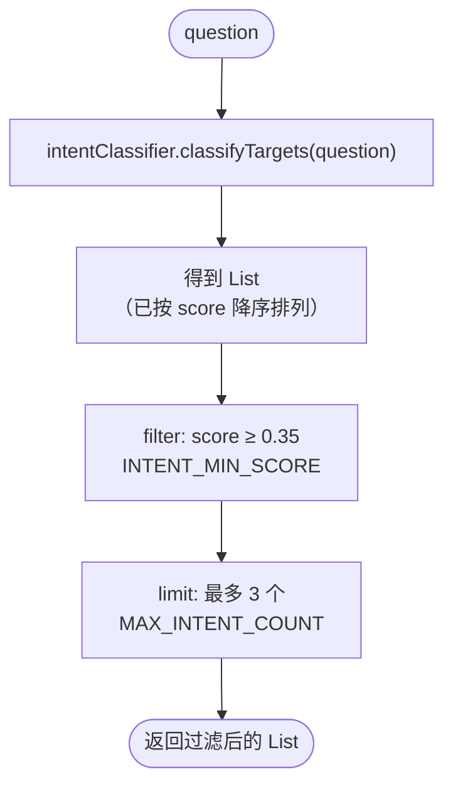
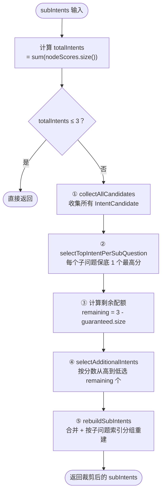
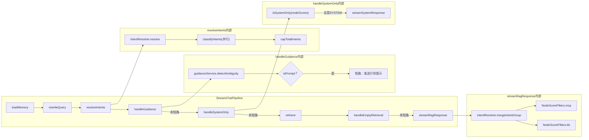
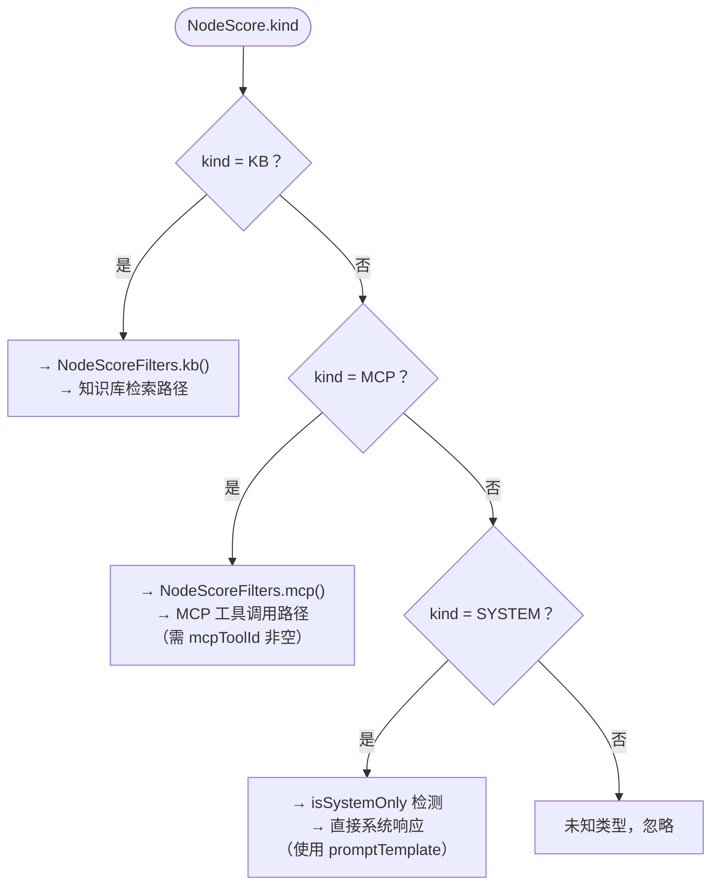

# resolveIntents 完整流程文档

## 概览

`resolveIntents` 是 `StreamChatPipeline` 流式对话管道中的**意图解析阶段**，负责将改写后的用户问题拆分为子问题，并为每个子问题通过 LLM 分类器识别匹配的意图节点及其分数，最终聚合为 `List<SubQuestionIntent>` 供后续歧义引导、检索和响应使用。

---

## 流程图

```mermaid
flowchart TD
    START([resolveIntents 入口]) --> GET_REWRITE["获取 RewriteResult<br/>ctx.getRewriteResult()"]

    GET_REWRITE --> CHECK_SUBQ{"subQuestions 是否非空？"}
    CHECK_SUBQ -- 是 --> USE_SUBQ["使用 subQuestions 列表<br/>作为子问题集合"]
    CHECK_SUBQ -- 否 --> USE_REWRITTEN["使用 rewrittenQuestion<br/>作为唯一子问题<br/>List.of(rewrittenQuestion)"]

    USE_SUBQ --> PARALLEL["并行分类：对每个子问题<br/>创建 CompletableFuture"]
    USE_REWRITTEN --> PARALLEL

    PARALLEL --> CLASSIFY["classifyIntents(question)<br/>意图分类（每个子问题）"]

    CLASSIFY --> CALL_CLASSIFIER["intentClassifier.classifyTargets(question)<br/>调用 LLM 分类器返回 List<NodeScore>"]

    CALL_CLASSIFIER --> FILTER_SCORE["分数过滤：score ≥ INTENT_MIN_SCORE(0.35)"]
    FILTER_SCORE --> LIMIT_COUNT["数量限制：limit(MAX_INTENT_COUNT=3)"]
    LIMIT_COUNT --> BUILD_SUBINTENT["构建 SubQuestionIntent<br/>(subQuestion, filteredNodeScores)"]

    BUILD_SUBINTENT --> CATCH_ERROR{"分类是否异常？"}
    CATCH_ERROR -- 是 --> DEGRADE["降级：SubQuestionIntent<br/>(question, List.of())"]
    CATCH_ERROR -- 否 --> COLLECT["CompletableFuture.join()<br/>收集所有 SubQuestionIntent"]

    DEGRADE --> COLLECT

    COLLECT --> CAP_TOTAL["capTotalIntents(subIntents)<br/>总意图数量上限控制"]

    CAP_TOTAL --> CALC_TOTAL["计算总意图数<br/>totalIntents = sum(nodeScores.size())"]
    CALC_TOTAL --> CHECK_TOTAL{"totalIntents ≤ MAX_INTENT_COUNT(3)？"}
    CHECK_TOTAL -- 是 --> RETURN_DIRECT["直接返回 subIntents"]
    CHECK_TOTAL -- 否 --> COLLECT_ALL["collectAllCandidates(subIntents)<br/>收集所有 IntentCandidate"]

    COLLECT_ALL --> SORT_CANDIDATES["按 score 降序排序所有候选"]
    SORT_CANDIDATES --> SELECT_TOP["selectTopIntentPerSubQuestion<br/>每个子问题保留 1 个最高分意图"]

    SELECT_TOP --> CALC_REMAINING["计算剩余配额<br/>remaining = MAX_INTENT_COUNT - guaranteed.size"]
    CALC_REMAINING --> SELECT_ADDITIONAL["selectAdditionalIntents<br/>从剩余候选中按分数高→低选取<br/>最多 remaining 个"]

    SELECT_ADDITIONAL --> REBUILD["rebuildSubIntents<br/>合并 guaranteed + additional<br/>按子问题索引分组重建"]

    REBUILD --> SET_CTX["ctx.setSubIntents(subIntents)<br/>写入管道上下文"]
    RETURN_DIRECT --> SET_CTX
    SET_CTX --> END([resolveIntents 完成])
```



---

## 内部函数详细流程

### 1. `resolve(RewriteResult)` — 主入口

```
输入: RewriteResult (rewrittenQuestion, subQuestions)
输出: List<SubQuestionIntent>
```

- **子问题确定**：如果 `subQuestions` 非空则使用子问题列表，否则将 `rewrittenQuestion` 作为唯一子问题
- **并行分类**：为每个子问题创建 `CompletableFuture`，在 `intentClassifyExecutor` 线程池中异步执行 `classifyIntents`
- **异常降级**：任何子问题分类失败时，降级为空意图列表 `List.of()`
- **总意图裁剪**：最终通过 `capTotalIntents` 控制总意图数不超过 `MAX_INTENT_COUNT(3)`

### 2. `classifyIntents(String question)` — 单个子问题的意图分类



- 调用 `IntentClassifier.classifyTargets()` — LLM 对所有叶子节点做意图匹配打分
- 过滤掉低于 `INTENT_MIN_SCORE(0.35)` 的结果（视为"聊偏了"）
- 限制单子问题最多返回 `MAX_INTENT_COUNT(3)` 个意图

### 3. `capTotalIntents(List<SubQuestionIntent>)` — 总意图数量上限控制



#### 3a. `collectAllCandidates` — 收集所有候选

- 将每个子问题的所有 `NodeScore` 打包为 `IntentCandidate(subQuestionIndex, nodeScore)`
- 按 `score` **降序排序**，为后续分配做准备

#### 3b. `selectTopIntentPerSubQuestion` — 保底策略

- 遍历所有候选（已按分数降序）
- 每个子问题索引只取第一个出现的候选（即该子问题的最高分意图）
- 所有子问题都有保底后提前退出

#### 3c. `selectAdditionalIntents` — 额外配额分配

- 从候选列表中跳过已被保底选中的
- 按分数从高到低依次选取，直到填满 `remaining` 配额

#### 3d. `rebuildSubIntents` — 重建结果

- 合并 `guaranteedIntents` + `additionalIntents`
- 按 `subQuestionIndex` 分组，重建每个 `SubQuestionIntent`

---

## 关键数据结构

| 结构 | 字段 | 说明 |
|---|---|---|
| **RewriteResult** | `rewrittenQuestion`, `subQuestions` | 改写后的主问题 + 拆分后的子问题列表 |
| **SubQuestionIntent** | `subQuestion`, `nodeScores` | 一个子问题及其匹配的意图候选 |
| **NodeScore** | `node`(IntentNode), `score`(double) | 叶子节点 + LLM 匹配分数 |
| **IntentCandidate** | `subQuestionIndex`, `nodeScore` | 带子问题索引的候选，用于裁剪排序 |
| **IntentNode** | `id`, `name`, `kind`, `kbId`, `collectionName`, `mcpToolId`, `promptTemplate` 等 | 意图树节点，kind 可为 KB/MCP/SYSTEM |
| **IntentGroup** | `mcpIntents`, `kbIntents` | 意图按 MCP/KB 分组的结果 |

---

## 关键常量

| 常量 | 值 | 说明 |
|---|---|---|
| `INTENT_MIN_SCORE` | 0.35 | 低于此分数视为"聊偏了"，不参与检索 |
| `MAX_INTENT_COUNT` | 3 | 单次查询最多参与的意图数量上限 |

---

## 完整调用链（含下游使用）



---

## IntentKind 分类与处理路径



---

## 异常处理策略

| 场景 | 处理方式 |
|---|---|
| 单个子问题分类异常 | 降级为空意图 `SubQuestionIntent(question, List.of())`，不影响其他子问题 |
| 总意图数超限 | 保底策略：每子问题至少保留1个最高分，剩余配额按分数分配 |
| 无意图匹配（所有分数 < 0.35） | 后续 `handleEmptyRetrieval` 会返回"未检索到相关文档" |
