# rewriteQuery 完整流程文档

## 总览

`rewriteQuery` 是 RAG 流式对话管道（`StreamChatPipeline`）中的**第二个阶段**，负责对用户原始问题进行改写和多问句拆分，产出 `RewriteResult` 供后续意图识别和检索使用。

### 入口方法全景

`QueryRewriteService` 接口提供三个入口方法，最终均汇聚到 `MultiQuestionRewriteService` 的核心实现：

| 入口方法 | 场景 | 最终调用 |
|---------|------|---------|
| `rewrite(question)` | 仅需改写结果（不拆分） | → `rewriteAndSplit(question)` → 取 `.rewrittenQuestion()` |
| `rewriteWithSplit(question)` | 无历史上下文场景 | → `rewriteAndSplit(question)` |
| `rewriteWithSplit(question, history)` | **管道实际调用**，含会话历史 | → 归一化 → `callLLMRewriteAndSplit(normalized, original, history)` |

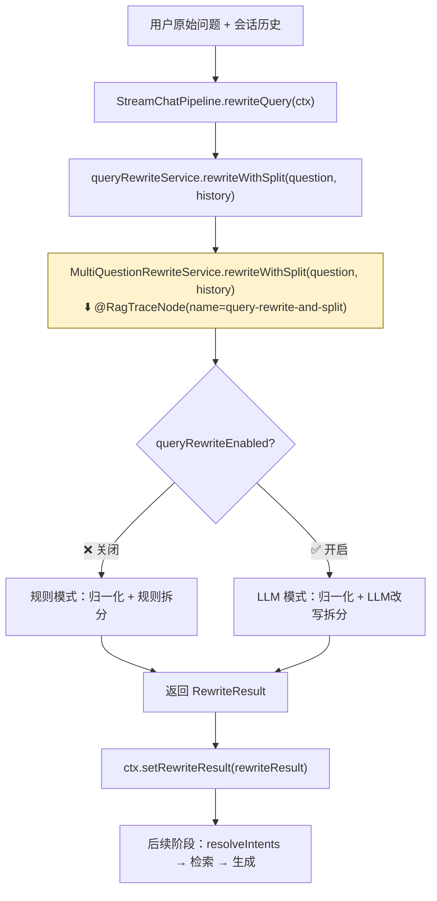

> **💡 @RagTraceNode 说明**：`@RagTraceNode` 是 RAG 链路追踪注解（定义于 `framework.trace` 包），标注在方法上后，AOP 切面会自动记录该节点的执行耗时、入参和出参，用于全链路可观测性。注解属性：`name`（节点名称，用于展示）、`type`（节点类型，用于分组统计）。

---

## 详细流程图

> **⚠️ 注意**：管道实际调用的是带 history 的 `rewriteWithSplit(question, history)` 方法。另有 `rewrite(question)` 和 `rewriteWithSplit(question)` 两个入口走私有方法 `rewriteAndSplit()`（无历史参数），其内部逻辑与带历史版本相同，只是 `callLLMRewriteAndSplit` 的 history 参数传空列表。

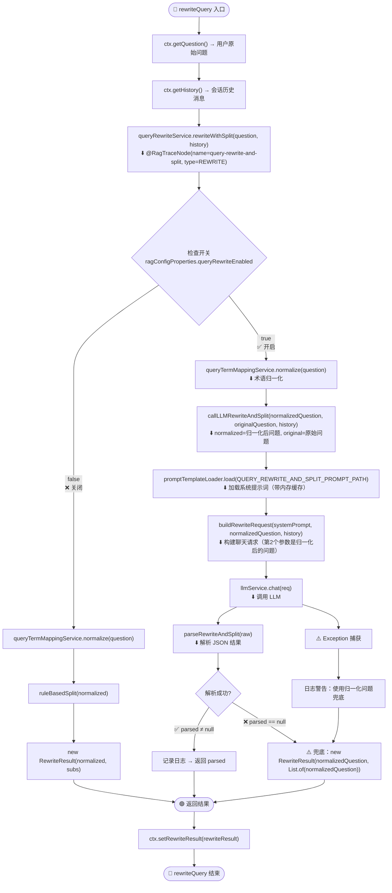

### 另两个入口方法流程

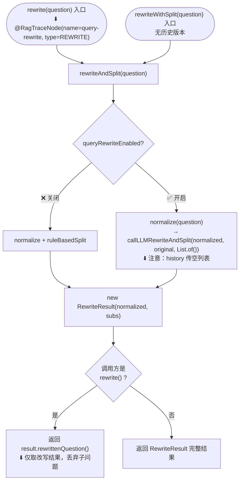

---

## 核心内部函数详解

### 1. QueryTermMappingService.normalize — 术语归一化

**职责**：将用户问题中的非标准术语替换为标准术语（如 "平安保司" → "平安保险"）

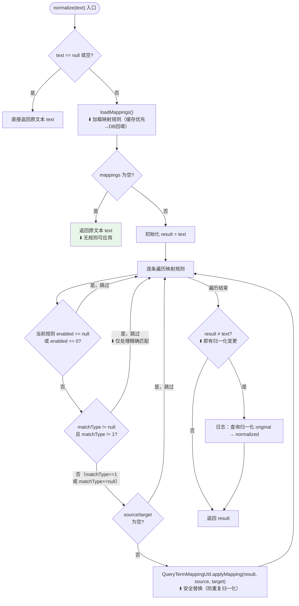

#### 1.1 loadMappings — 加载映射规则

> **⚠️ 排序逻辑说明**：代码使用 `Comparator.comparing(priority, nullsLast(Integer::compareTo)).reversed().thenComparing(sourceTerm.length, reverseOrder())`。
> - `.comparing(priority, nullsLast)` 构造升序比较器（null排末尾）
> - `.reversed()` 反转整个比较器 → 变为 **priority 降序**，且 `nullsLast` 也被反转，**null 排首位**（等同于 nullsFirst 效果）
> - `.thenComparing(sourceTerm长度, reverseOrder())` = 长词排在前面，优先匹配
> - **⚠️ 设计矛盾**：`QueryTermMappingDO.priority` 字段注释说"数值越小优先级越高"，但代码按 **降序排列**（大值先执行），这意味着 **优先级数值越大的规则实际先被应用**，与注释语义相反。同时，priority 为 null 的规则会排在最前面先执行，这可能也不是预期行为。长词优先匹配的需求通过 `thenComparing` 的长度降序来实现。

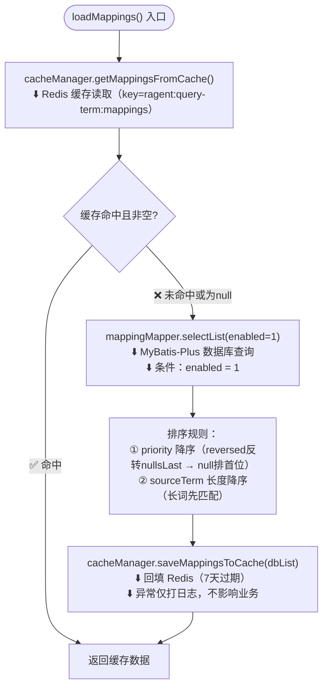

#### 1.2 QueryTermMappingUtil.applyMapping — 安全替换

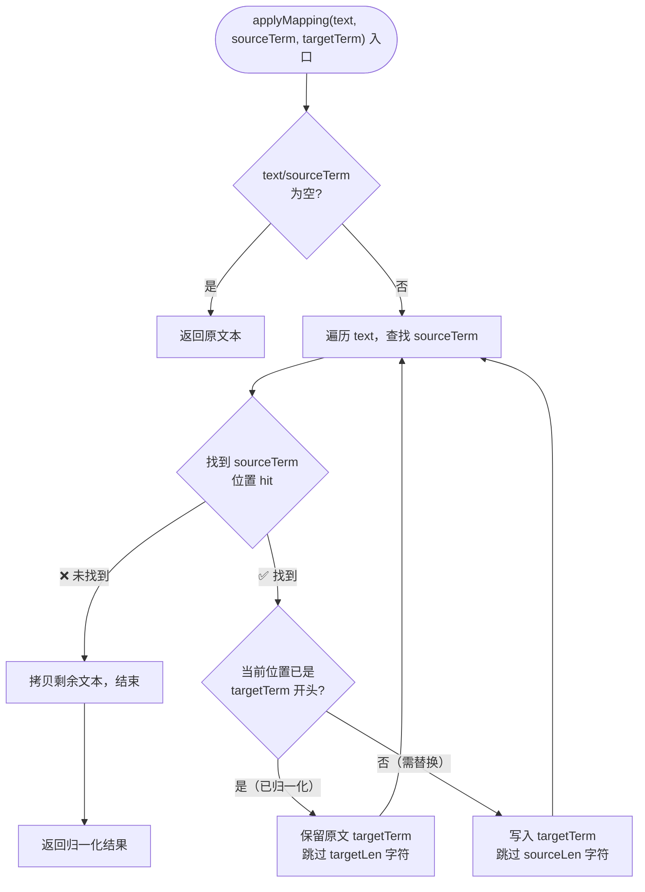

**映射规则数据结构**（`QueryTermMappingDO`）：

| 字段 | 说明 |
|------|------|
| `sourceTerm` | 用户原始短语 |
| `targetTerm` | 归一化目标短语 |
| `matchType` | 匹配类型：1=精确匹配（当前仅用此类型） |
| `priority` | 优先级（数值越小越高，长词优先匹配） |
| `enabled` | 1=生效，0=禁用 |
| `domain` | 业务域标识（可选） |

---

### 2. callLLMRewriteAndSplit — LLM 改写 + 拆分

**职责**：将归一化后的问题通过 LLM 改写为适合检索的查询，并判断是否需要拆分为多个子问题

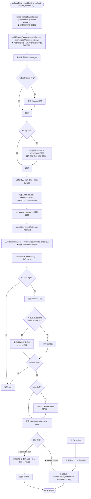

---

### 3. ruleBasedSplit — 规则拆分（兜底）

**职责**：当 LLM 不可用或开关关闭时，按常见分隔符拆分多问句

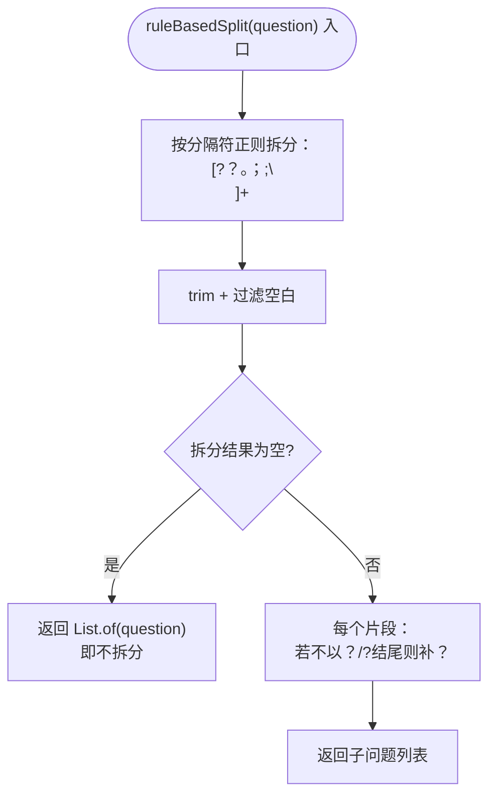

---

### 4. buildRewriteRequest — 构建聊天请求

**职责**：组装 LLM 调用所需的 `ChatRequest`，控制历史消息截断

> **⚠️ 历史截断逻辑细节**：代码 `history.stream().filter(...).skip(Math.max(0, history.size() - 4))` 中，`skip` 的数值基于**原始 history.size()** 而非过滤后的列表大小。这意味着当 history 中含有大量 System 消息时，filter 先筛掉 System 消息，但 skip 仍按原始数量跳过，可能导致实际保留的历史消息少于 4 条甚至为空。这是当前实现的一个潜在问题。

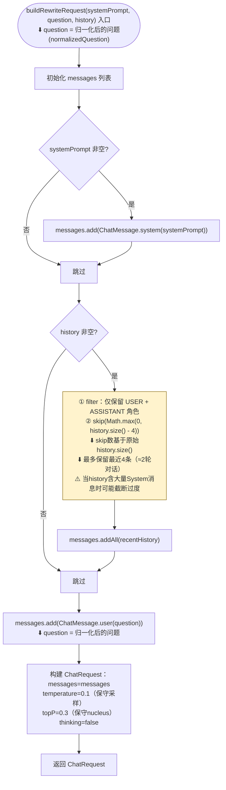

---

### 5. parseRewriteAndSplit — 解析 LLM JSON 输出

**职责**：将 LLM 返回的 JSON 文本解析为 `RewriteResult`

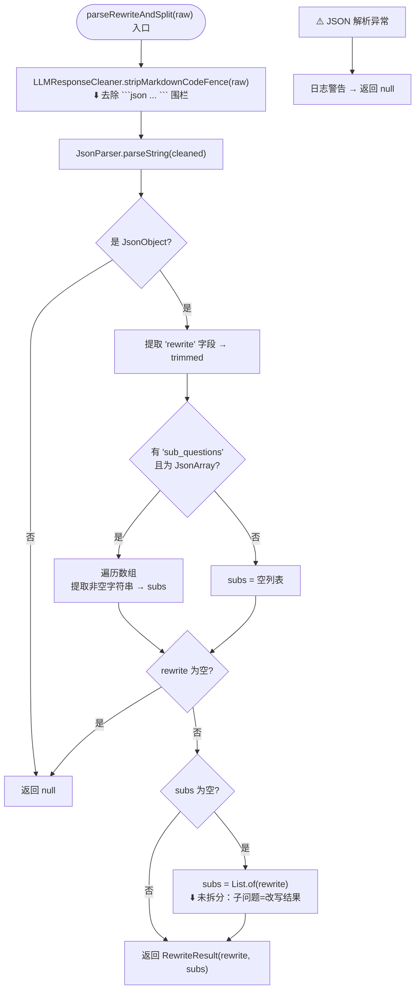

---

### 6. LLMResponseCleaner.stripMarkdownCodeFence — 去除代码围栏

**职责**：清理 LLM 输出中可能包裹的 Markdown 代码块标记

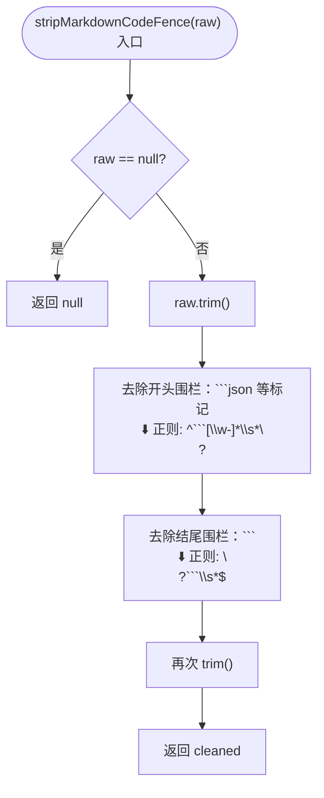

---

### 7. PromptTemplateLoader.load — 提示词模板加载

**职责**：从 classpath 加载提示词模板文件，带内存缓存，避免重复 IO

> 模板路径常量：`QUERY_REWRITE_AND_SPLIT_PROMPT_PATH = "prompt/user-question-rewrite.st"`，定义于 `RAGConstant`。

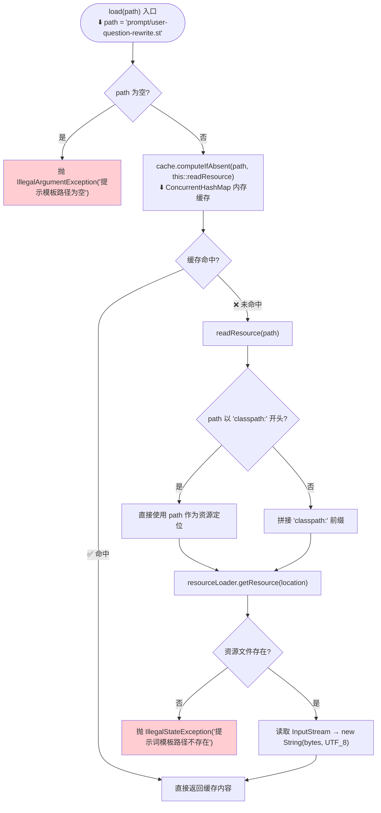

---

## 数据流总结

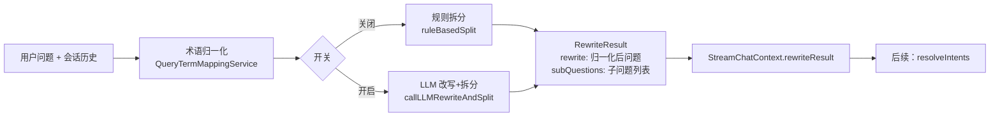

---

## 关键配置项

| 配置 | 说明 | 默认值 |
|------|------|--------|
| `rag.query-rewrite.enabled` | 是否启用 LLM 查询改写 | `true` |
| LLM `temperature` | 改写请求的温度参数 | `0.1` |
| LLM `topP` | 改写请求的 top_p 参数 | `0.3` |
| LLM `thinking` | 是否启用思维链 | `false` |
| 历史消息截断 | 最多保留最近 4 条（2轮对话） | 系统过滤 USER+ASSISTANT |
| 缓存过期 | 术语映射 Redis 缓存有效期 | 7 天 |

---

## 异常兜底策略

| 场景 | 兜底行为 |
|------|----------|
| `queryRewriteEnabled=false` | 仅做术语归一化 + 规则拆分，不调用 LLM |
| LLM 调用抛出异常 | 使用归一化问题作为改写结果，子问题=归一化问题 |
| LLM 返回 JSON 解析失败 | 同上兜底 |
| `rewrite` 字段为空 | 视为解析失败，走兜底 |
| `sub_questions` 为空/缺失 | 子问题列表 = `[rewrite]`，即不拆分 |
| 术语映射缓存/DB 均不可用 | 跳过归一化，使用原始问题 |
| 归一化映射 `matchType≠1` | 跳过该条规则 |

---

## 类与方法索引

| 类 | 方法 | 职责 | 注解 |
|----|------|------|------|
| `StreamChatPipeline` | `rewriteQuery(ctx)` | 管道入口，调用 service 并设置上下文 | — |
| `QueryRewriteService` | `rewrite(question)` | 接口：仅改写，返回字符串 | — |
| `QueryRewriteService` | `rewriteWithSplit(question)` | 接口：改写+拆分，无历史 | — |
| `QueryRewriteService` | `rewriteWithSplit(question, history)` | 接口：改写+拆分，含历史（管道实际调用） | — |
| `MultiQuestionRewriteService` | `rewrite(question)` | 实现：调用 rewriteAndSplit → 取 rewrittenQuestion | `@RagTraceNode(name=query-rewrite)` |
| `MultiQuestionRewriteService` | `rewriteWithSplit(question)` | 实现：调用 rewriteAndSplit（无历史） | — |
| `MultiQuestionRewriteService` | `rewriteWithSplit(question, history)` | **主入口**：开关判断 → 归一化 → LLM/规则 | `@RagTraceNode(name=query-rewrite-and-split)` |
| `MultiQuestionRewriteService` | `rewriteAndSplit(question)` | 私有：无历史版本核心逻辑（被 rewrite 和无历史 rewriteWithSplit 调用） | — |
| `MultiQuestionRewriteService` | `callLLMRewriteAndSplit(normalized, original, history)` | 调用 LLM 进行改写+拆分 | — |
| `MultiQuestionRewriteService` | `buildRewriteRequest(systemPrompt, question, history)` | 组装 ChatRequest（含历史截断） | — |
| `MultiQuestionRewriteService` | `parseRewriteAndSplit(raw)` | 解析 LLM JSON 输出 → RewriteResult | — |
| `MultiQuestionRewriteService` | `ruleBasedSplit(question)` | 规则拆分兜底：按分隔符拆分多问句 | — |
| `QueryTermMappingService` | `normalize(text)` | 术语归一化：遍历规则做安全替换 | — |
| `QueryTermMappingService` | `loadMappings()` | 加载映射规则（缓存优先→DB回填） | — |
| `QueryTermMappingCacheManager` | `getMappingsFromCache()` | Redis 缓存读取（key=`ragent:query-term:mappings`） | — |
| `QueryTermMappingCacheManager` | `saveMappingsToCache(mappings)` | Redis 缓存回填（7天过期） | — |
| `QueryTermMappingCacheManager` | `clearCache()` | 清除缓存（映射规则增删改时调用） | — |
| `QueryTermMappingUtil` | `applyMapping(text, source, target)` | 安全替换：防重复归一化（若已是target则不替换） | — |
| `LLMResponseCleaner` | `stripMarkdownCodeFence(raw)` | 去除 Markdown 代码围栏（```json ... ```） | — |
| `PromptTemplateLoader` | `load(path)` | 从 classpath 加载提示词模板（带 ConcurrentHashMap 缓存） | — |
| `PromptTemplateLoader` | `render(path, slots)` | 加载模板 + 填充变量 + 清理 | — |
| `PromptTemplateLoader` | `loadSection(path, section)` | 加载模板中指定 section | — |
| `PromptTemplateLoader` | `renderSection(path, section, slots)` | 加载 section + 填充变量 | — |
| `RewriteResult` | record | `rewrittenQuestion + subQuestions` 两个字段 | — |
| `RAGConstant` | `QUERY_REWRITE_AND_SPLIT_PROMPT_PATH` | 常量：`"prompt/user-question-rewrite.st"` | — |
| `RAGConfigProperties` | `queryRewriteEnabled` | 配置：`rag.query-rewrite.enabled`（默认 true） | — |
| `QueryTermMappingDO` | 实体类 | 映射规则数据结构（sourceTerm/targetTerm/matchType/priority/enabled/domain） | — |
| `ChatRequest` | builder | 通用大模型请求对象（messages/temperature/topP/topK/maxTokens/thinking/enableTools） | — |
| `RagTraceNode` | 注解 | RAG 链路追踪节点标记（AOP切面记录耗时、入参、出参） | 属性：name, type |

---

## LLM 提示词模板（user-question-rewrite.st）核心要点

- **角色**：查询改写助手，用于 RAG 检索阶段
- **输出格式**：严格 JSON `{ rewrite, should_split, sub_questions }`
- **改写规则**：
  - 保留专有名词、关键限制、业务场景
  - 删除礼貌用语、回答指令、无关描述
  - 禁止添加原文没有的条件/维度/假设
- **拆分规则**：
  - 多问号、显式列举、分号/换行 → 拆分
  - 抽象对比、笼统询问、不确定 → 不拆分
- **指代消解**：结合历史消息还原指代词（"它"、"这个"）
