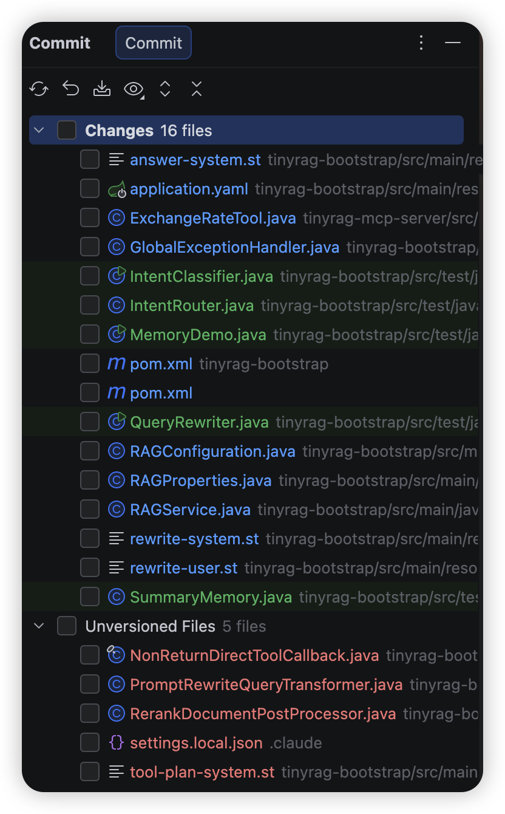

# 《AI大模型Ragent项目》——为什么不使用SpringAI或LangChain4j？

## 为什么 Ragent 选择手搓 RAG，而非 Spring AI

很多同学看到项目里没有用 Spring AI，也没有用 LangChain4j，第一反应是——为什么要自己造轮子？

回答这个问题，得先回到做决策的那个时间点。

## 时间线：Spring AI 刚刚发布 1.0

Ragent 项目启动于 **2025 年 6 月**。这个时间点很关键——Spring AI 1.0.0 GA 是 **2025 年 5 月 20 日**发布的，距离 Ragent 开始做只有**不到一个月**。

换句话说，当 Ragent 做技术选型的时候，Spring AI 刚刚拥有自己的第一个正式发行版。

| 时间节点 | 事件 |
| --- | --- |
| 2023 年中 | Spring AI 项目启动，开始发布里程碑版本（M1、M2……） |
| 2025 年 5 月 13 日 | Spring AI 1.0.0-RC1 发布 |
| 2025 年 5 月 20 日 | Spring AI 1.0.0 GA 发布（第一个正式版） |
| 2025 年 6 月 | Ragent 项目着手启动 |
| 2025 年 10 月 | Spring AI 1.0.3 发布（补丁版） |
| 2025 年 11 月 | Spring AI 1.1.0 GA 发布 |

一个框架的 1.0 版本意味着什么？意味着 API 刚刚稳定下来。在此之前的里程碑阶段，Spring AI 的核心 API 经历了多次重构——`ChatClient` 被完全重新设计过，`FunctionCallback` 整体更名为 `ToolCallback`，对话记忆模块也做了架构级调整（`InMemoryChatMemory` 被删除，拆分为 `MessageWindowChatMemory` + `InMemoryChatMemoryRepository` 的双层设计），M7 到 M8 之间还出现过旧 API 静默失效的破坏性变更。1.0 GA 的发布标志着 API 进入稳定期，但一个刚稳定的框架和一个经过生产验证的成熟框架之间，差距不小。

## Spring AI 1.0 给了什么

站在 2025 年中这个时间点看，Spring AI 1.0 已经提供了相当完整的 RAG 基础设施：

- **ChatClient**：统一的模型调用接口，1.0 GA 时官方宣称可对接 20 个 AI Model 集成

- **QuestionAnswerAdvisor**：开箱即用的简易 RAG，查向量库 → 拼进 Prompt → 调模型

- **RetrievalAugmentationAdvisor**：模块化 RAG 架构，提供了 `QueryTransformer`、`QueryExpander`、`DocumentRetriever`、`DocumentPostProcessor` 等扩展点

- **ETL Pipeline**：文档提取 → 转换 → 加载的管道

- **VectorStore 抽象**：支持 Milvus、PGVector、Redis 等 14+ 向量数据库

- **ChatMemory**：对话记忆管理

- **Structured Output**：模型输出直接映射到 Java 对象

如果你要做一个 Demo，或者做一个查知识库回答问题的简单场景，这些足够了。`QuestionAnswerAdvisor` 几行代码就能跑起来，体验确实很好。但它更适合快速起步，而不是直接承载高定制、长生命周期的企业项目。

## API 变更：升级一次，重构一次

这是我选择手搓最直接的原因之一。

我当时用 Spring AI 1.0 写了一个小的 RAG Demo，功能不复杂。后来升级到 1.0.2（还是 1.0.3 记不太清了），结果代码大面积爆红——不是改几个方法名的事，而是整体的类结构、接口定义、包路径都变了，跟重构没区别。

你不希望自己在公司里做的项目，在未来升级的时候，和重写一遍没什么两样吧。谁都不敢赌这件事，除非你做的项目功能单一，未来不存在大的功能迭代。

### 1. 对话记忆 API 的大幅重构

这是最典型的案例。Spring AI 的 ChatMemory 相关 API 在版本迭代过程中经历了明显的重构，迁移成本不低。以下变更均可在 [官方升级说明](https://docs.spring.io/spring-ai/reference/upgrade-notes.html) 中查证：

- 核心常量全部重命名：`CHAT_MEMORY_CONVERSATION_ID_KEY` → `CONVERSATION_ID`（同时从 `AbstractChatMemoryAdvisor` 移到了 `ChatMemory` 接口），`CHAT_MEMORY_RETRIEVE_SIZE_KEY` → `TOP_K`，`DEFAULT_CHAT_MEMORY_RESPONSE_SIZE`（值为 100）→ `DEFAULT_TOP_K`（值改为 20）

- `AbstractChatMemoryAdvisor` 被替换为 `BaseChatMemoryAdvisor` 接口，所有直接继承它的代码全部失效

- `VectorStoreChatMemoryAdvisor` 的构造函数改为 private，强制使用 Builder；`chatMemoryRetrieveSize()` 方法改名为 `defaultTopK()`

- Chat Memory 相关模块的 artifact ID、包名也加上了 `repository` 后缀（如 `spring-ai-autoconfigure-model-chat-memory-cassandra` → `spring-ai-autoconfigure-model-chat-memory-repository-cassandra`）

之前写的代码长这样：

textjavascripttypescriptcsshtmlbashjsonmarkdownpythonjavaccpprubygorustphpsqlyaml Copy

```
                new MessageChatMemoryAdvisor(new InMemoryChatMemory())

```

现在推荐的写法变成了：

textjavascripttypescriptcsshtmlbashjsonmarkdownpythonjavaccpprubygorustphpsqlyaml Copy

```
                ChatMemory chatMemory = MessageWindowChatMemory.builder()
    .maxMessages(10)
    .build();

```

你说这个改动合不合理？从设计角度来说，新的 API 确实更清晰。但问题不在于新 API 好不好，而在于——对一个刚进入 GA 的框架来说，这类核心 API 的迁移成本偏高。从团队长期投资的角度看，我当时不愿意把项目绑死在这条演进曲线上。

### 2. 工具调用 API 的静默失效

还有一个更坑的。M7 到 M8 升级时，`tools()` 方法被改名为 `toolCallbacks()`，但旧的 `tools()` 方法**没有报错，也没有标记 @Deprecated**——它就是静默地不生效了。你的代码编译通过、运行正常、没有任何异常日志，但工具就是不会被调用。官方升级说明里明确写了这个问题（[对应 commit](https://github.com/spring-projects/spring-ai/commit/5b7849de088b3c93c7ec894fcaddc85a611a8572)）：使用 deprecated `tools()` 的代码会导致 tool calling silently fail。

这种悄悄坏掉的问题比编译报错还可怕。编译报错至少告诉你哪里需要改，静默失效可能让你排查好几个小时才发现问题出在框架升级上。

> Spring AI 团队后来专门出了一份 [FunctionCallback 到 ToolCallback 的迁移指南](https://docs.spring.io/spring-ai/reference/api/tools-migration.html)，社区甚至搞了一个 OpenRewrite 自动迁移工具（Arconia Migrations）来帮助开发者批量重构代码。一个框架需要专门的自动化迁移工具来应对版本升级——这本身就说明迁移成本不是小事。

### 3. 关于 API 稳定性的体感

哪怕是现在的 2.0.0-M2，在 API 稳定性上甚至都不如 Spring Boot 1.5。Spring Boot 从 1.x 到 2.x 是一次大版本升级，改动当然大，但它在小版本之间的兼容性做得非常好。Spring AI 的问题是：**小版本之间就能给你来一次较大的破坏性变更**。这对生产项目来说太不友好了。

## 工具调用：从设计到实现都有坑

Ragent 的一个核心场景是：用户的一个问题，可能既需要查知识库，又需要调用外部工具（MCP）。比如"帮我查一下 OA 系统的请假规则，顺便看看我还剩几天年假"——前半句查知识库，后半句调 API。

### 1. RAG + 工具调用的设计冲突

社区中已经有人报告过这个组合下的问题（[Issue #3310](https://github.com/spring-projects/spring-ai/issues/3310)）：当 `RetrievalAugmentationAdvisor` 和 `ToolCallbacks` 同时配置在 `ChatClient` 上时，模型调用工具的倾向会**明显下降**，我自己的体验与之接近。这个问题比较隐蔽——测试阶段你会发现工具能被调用，就觉得没问题上线了。但实际到了生产环境，大量真实用户的问题比测试用例复杂得多，工具调用的触发率会显著低于预期，用户发现该查的数据查不到、该调的接口没调，投诉就来了。

原因也不复杂——`ContextualQueryAugmenter` 的默认 Prompt 模板里有两条关键指令：

> "Given the context information and **no prior knowledge**, answer the query."
> "If the answer is not in the context, just say that you don't know."

"no prior knowledge" 这个约束直接告诉模型“不要用你自己的能力，只根据提供的上下文回答”。工具调用属于模型的自有能力，自然也被压制了。模型拿到了检索内容之后，就倾向于从里面找答案，而不是去调用工具。即使检索到的内容和用户问题不完全匹配，模型也宁可硬着头皮从上下文里凑一个答案，也不愿意调工具。

你可以通过自定义 Prompt 模板来缓解这个问题，但这等于你得自己处理“什么时候该查知识库、什么时候该调工具、什么时候两个都要做”的路由逻辑——而这正是 Ragent 的意图分类系统要做的事。

### 2. MCP 集成的参数解析 Bug

上面说的是设计层面的问题，下面说一个实现层面的——我自己踩的。

当时我用 Spring AI 1.1.2（Release 版本）做 MCP 集成，Client 端调用 MCP Server 的工具死活不生效，一直报参数为空。排查了很久才发现，是 Spring AI 的 MCP Client 在接收到 Server 返回的工具定义信息后，**把其中一个 Function 的参数 Schema 解析错了**，导致实际调用时传了空参数（非常抽象）。

这个问题在升级到 2.0 的版本之后就好了——说明 1.1.2 确实存在这个 Bug。但当时排查的过程非常痛苦，因为错误表现是参数为空，你第一反应是去检查自己的代码，不会想到是框架的解析逻辑出了问题。这种深层的信任成本，只有踩过坑的人才懂。

> 我说升级到 2.0-M2 版本好了不是说功能好了，而是 1.1.2 版本的 BUG 好了，然后又出现了新的问题。后面章节我会单独把 1.1.2 这个案例拿出来，给大家看看具体的报错和排查过程。

从设计层面的 RAG 与工具调用冲突，到实现层面的 MCP 参数解析 Bug——工具调用这条链路上，Spring AI 的坑是面上有风险、点上有实锤。

## 适配越多，坑越多

Spring AI 一个很吸引人的卖点是广泛的适配——14+ 向量数据库、20 个 AI Model 集成。听起来很美好，但在实际使用中，广度和深度往往是矛盾的。

### 1. 向量数据库：两头堵

拿 Milvus 举个例子。Milvus 自身在高速迭代，SDK 版本频繁发布，新版本会带来新的 API、新的索引类型、性能优化。但 Spring AI 内部绑定的是特定版本的 Milvus Java SDK——如果 Spring AI 没有及时更新对应的适配包，你就享受不到 Milvus 新版本的能力；你要是自己强行升级 Milvus SDK 版本，又可能引入依赖冲突。

引用 B 站知名 UP 主麻薯波比一句话“一根筋变成两头堵”——不升级用不了新功能，升级了可能到处冲突。

公开 Issue 中至少能看到这几类典型问题：Embedding 维度限制被硬编码成 2048，不兼容 4096 维的模型（[#608](https://github.com/spring-projects/spring-ai/issues/608)）；`collectionName` 配置明明设置成功了，运行时却始终使用默认的 `vector_store`（[#2501](https://github.com/spring-projects/spring-ai/issues/2501)）；相似度搜索时抛出 `distance` 字段找不到的异常（[#1256](https://github.com/spring-projects/spring-ai/issues/1256)）。这些都不是边缘 Case，而是基本使用场景下的问题。

> Spring AI 官方团队自己也意识到了维护压力。2025 年 10 月，他们专门发了一篇[博客](https://spring.io/blog/2025/10/07/spring-ai-community-announcement/)宣布成立 Spring AI Community 社区组织，把一些集成（如 Moonshot、QianFan 等国内模型）从核心仓库移出去，原因是"the core team cannot easily maintain or nurture within the main repository"。集成得越多，维护成本就越高，出问题的概率就越大——这不是 Spring AI 的错，是个自然规律。除非投入大量人力做持续适配，否则广度和质量很难兼得。

### 2. 模型适配：协议碎片化

大模型的发展速度比向量库还快。从最早的纯文本对话，到现在的多模态、Function Call、Structured Output、Reasoning，能力在不断扩展。如果所有模型都遵守同一个协议（比如 OpenAI 的 Chat Completions API），适配起来还好。但 Anthropic 搞了自己的一套协议——finish reason 用 `end_turn` 而不是 `stop`，工具调用的格式也不一样，结构化输出需要单独扩展 API。感兴趣的同学可以对比看看两家的 API 文档，差异一目了然：

- [OpenAI Chat Completions API](https://platform.openai.com/docs/api-reference/chat/object)

- [Anthropic Messages API](https://docs.anthropic.com/en/api/messages)

Spring AI 的做法是为每个 Provider 写独立的适配器，但这就导致了不同 Provider 之间的行为不一致。同一个功能（比如流式工具调用），在 OpenAI 适配器里是正常的，在 Anthropic 适配器里可能会触发不同的 Bug（比如流式请求时工具被调用两次，[#1370](https://github.com/spring-projects/spring-ai/issues/1370)）、在 Qwen 适配器里又是另一种问题（流式 tool_calls 中 tool name 只在第一个 frame 里带、后续 frame 为空导致异常，[#4790](https://github.com/spring-projects/spring-ai/issues/4790)）。每个 Provider 都是一个独立的 Bug 池。

未来模型的能力还会继续演化，协议也可能继续分裂。这个风险现在还是个未知数。

Ragent 的做法是为项目中用到的模型单独适配 API，不经过中间抽象层，哪个模型的接口有变化就改哪个，灵活可控，也不会被框架的适配节奏卡住。

## 连 AI 都写不好 Spring AI 代码

这个点可能有些同学不信，但确实如此。

我之前是打算给大家写一个 Spring AI 版本的 RAG，不像 Ragent 这么复杂，但至少能让大家有个对比参考。我用 Claude 4.6 Opus 深度思考模式来写——目前最强的编码模型了——结果效果很不理想。稍微复杂一点的场景，比如意图识别、一个请求里同时包含知识库问答和 MCP 工具调用、多个子问题分别路由，AI 写出来的代码总是在拆东墙补西墙。

原因很简单：Spring AI 的 API 变化太快，不同版本之间的写法差异很大。AI 的训练数据里混杂着 M1 到 1.1.2 各个版本的代码示例和教程，它不知道哪个版本的 API 是当前有效的。官方文档本身也有问题——Filter 表达式的构造方法写错了（后来 Issue 里修的）、ZhipuAI 的文档有误、Milvus 的字段文档链接过期……当框架的官方文档和社区教程都跟不上 API 变化的速度时，AI 自然也写不好。

到现在，那个 Spring AI 版本的 RAG 还没达到我的预期效果。目前陷入瓶颈了，不过我相信如果深入看看源码应该能搞定。哈哈。



## 现在造轮子和以前不一样了

以前说造轮子，意味着要花大量精力重复写代码，这个成本确实高。但现在借助 AI 的能力，把一个架子搭起来的速度比以前快得多。直接调 Milvus SDK 查向量库、用 OkHttp 调模型的 OpenAI 兼容接口——这些代码量加起来也就几百行，AI 几分钟就能生成。

> 虽然 Spring AI 提供了较多的抽象，但是单纯从 RAG 功能本身来说，其实代码并不多。

反过来，用框架做复杂项目的隐性成本其实在增加：依赖冲突要排查、API 变更要跟进、框架 Bug 要绕过、扩展点要研究怎么用。这些时间加起来，不比自己写少。

尤其是像 Ragent 这种定制化很高的项目，框架能帮你的那部分（向量库适配、模型调用封装）用 AI 几分钟就能写出来；框架帮不了你的那部分（意图路由、多通道检索、摘要记忆、模型熔断、首包探测），不管你用不用框架都得自己做。那框架的价值就只剩下一层额外的抽象——而这层抽象在版本升级时还可能给你捅刀子。

## 不用 Spring AI ≠ 什么都造轮子

有一点需要澄清：Ragent 没有用 Spring AI，但并不是所有东西都从零写的。

比如 MCP 协议的实现，Ragent 底层直接用的是 [Model Context Protocol 官方 Java SDK](https://modelcontextprotocol.io/docs/getting-started/intro)。像这种底层协议层面的东西，标准比较稳定，不会像应用框架那样频繁变更，直接用官方 SDK 就行。Spring AI 的 MCP 支持底层也是引用的这个 SDK——但它在上面又包了一层自己的抽象，而正是这层抽象在 1.1.2 中出了参数解析的 Bug。

所以选择的原则很清楚：**协议稳定、标准化程度高的底层能力，用成熟的 SDK；变化快、定制化需求高的应用层能力，自己掌握控制权。**

## 那 LangChain4j 呢

顺便提一下 LangChain4j。相比 Spring AI，LangChain4j 在 RAG 能力上覆盖得更广——它有更多切分策略、有 Query Routing、有 Re-ranking。但它的问题在另一个层面：

- 和 Spring Boot 生态的集成不够深，很多能力需要手动拼装

- 社区规模和文档质量与 Spring 体系有差距

最终的判断和 Spring AI 类似：能用，但当你的定制化需求很高时，框架能帮你的比例不够大。

## 回头看：Spring AI 后来怎么样了

Ragent 做了大半年之后，Spring AI 也在快速演进：

| 版本 | 发布时间 | 关键进展 |
| --- | --- | --- |
| 1.0.3 | 2025 年 10 月 | 补丁版，稳定性修复 |
| 1.1.0 GA | 2025 年 11 月 | 新增 MCP 集成，模型支持扩展 |
| 1.1.2 | 2025 年 12 月 | 补丁版，聚焦 Bug 修复、安全与依赖升级 |
| 2.0.0-M1 | 2025 年 12 月 | 里程碑版本（Preview），大量 Bug 修复 |
| 2.0.0-M2 | 2026 年 1 月 | 里程碑版本（Preview），修复了对话记忆中工具消息丢失等问题 |

> 当前官方文档首页将 1.1.2 / 1.0.3 标记为 Stable，将 2.0.0-M2 标记为 Preview。

Spring AI 在变好，这个不否认。但截至目前（2.0 仍是 Preview 版本，非正式发行版），Ragent 所需要的那些企业级能力——意图路由、多通道检索编排、记忆摘要压缩、多模型熔断——即使在今天的 Spring AI 里，也更多依赖扩展点自行编排，而不是开箱即用。这些不是 Bug，是框架尚未覆盖的能力域。

如果现在 Spring AI 是一个很稳定的版本，我会毫不犹豫选择它——我不是一个为了炫技而造轮子的人。但 AI 在 Java 领域的生态还在收敛中，要走向真正的稳定，可能得等到 Spring AI 3.x 版本才能实现。

## 未来不排斥框架

不管是 Spring AI 还是 LangChain4j，RAG 只是它们提供的能力之一。随着 AI 应用的演进，更复杂的能力正在成为刚需：

- **Agent / Agentic Workflow**：让模型具备多步推理、自主规划和执行的能力，而不只是单轮问答

- **Multi-Agent 编排**：多个 Agent 协作完成复杂任务，比如一个负责信息收集、一个负责分析决策

- **Evaluation 评估框架**：自动化评估 RAG 和 Agent 的效果，量化回答质量

- **Guardrails 安全护栏**：对输入输出做安全过滤与合规检查

- **Observability 链路追踪与监控**：对 AI 调用链路的全链路追踪、Token 用量统计、延迟监控，便于生产环境的问题排查和性能优化

这些能力的实现复杂度远高于 RAG 本身。当 Ragent 迈向 2.0 时代时，如果 Spring AI 或 LangChain4j 在这些方向上已经足够成熟和稳定，我不排除引入其中之一来实现更复杂的效果——毕竟，不重复造轮子本身就是工程上的正确选择。关键还是那个原则：**成熟了就用，没成熟就自己把控**。

## 总结

Ragent 选择手搓 RAG，不是因为 Spring AI 不行。Spring AI 的设计方向是对的，它作为 AI 应用开发的 Spring Boot 这个定位没问题。

核心原因是三个：

- **时间窗口**：做技术选型的时候，Spring AI 刚发布第一个正式版不到一个月。拿一个 1.0.0 的框架去撑一个生产级企业系统，风险评估上说不过去。

- **稳定性**：从核心 API 的频繁重构、到 RAG 和工具调用组合使用时的兼容性风险、到适配层的各种问题，Spring AI 在生产环境的可靠性上还需要时间来验证。一个好的框架不只是 API 设计好，还得让用户敢在上面做长期投资。

- **开箱即用覆盖率**：即便是后来的 1.1.2 版本，Spring AI 开箱即用的能力——简易 RAG、模型调用、向量库适配——只占 Ragent 整体功能的一小部分。多通道检索编排、意图分类路由、对话摘要压缩、多模型熔断、首包探测、场景化 Prompt、分布式限流、全链路追踪——这些构成了 Ragent 的核心能力，而它们不是 Spring AI 的开箱即用能力，更多要依赖扩展点自己编排。

而手搓 RAG 带来的优势也很明显：

- **完全可控**：每一层的实现逻辑都在自己手里，出了问题能直接定位到具体代码行，不用去翻框架源码猜它做了什么。

- **零升级负担**：不存在框架版本升级导致的 API 变更、依赖冲突、静默失效等问题，团队可以把精力集中在业务迭代上。

- **深度定制无上限**：意图路由、多通道检索、记忆摘要这些能力，不需要在框架的扩展点里“戴着镣铐跳舞”，想怎么设计就怎么设计。

- **依赖链更短**：直接调 Milvus SDK、直接发 HTTP 请求调模型，中间少了一层框架抽象，排查问题的链路更短，运行时的不确定性更少。

话说回来，不用 Spring AI 不代表排斥框架。像 MCP Java SDK 这种底层协议足够稳定的东西，直接用就好了。选择的原则始终是：**稳定的用现成的，变化快的自己把控**。

> Source: https://t.zsxq.com/OeRxm
> Resolved: https://articles.zsxq.com/id_vpv583egils3.html
